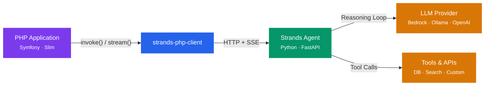
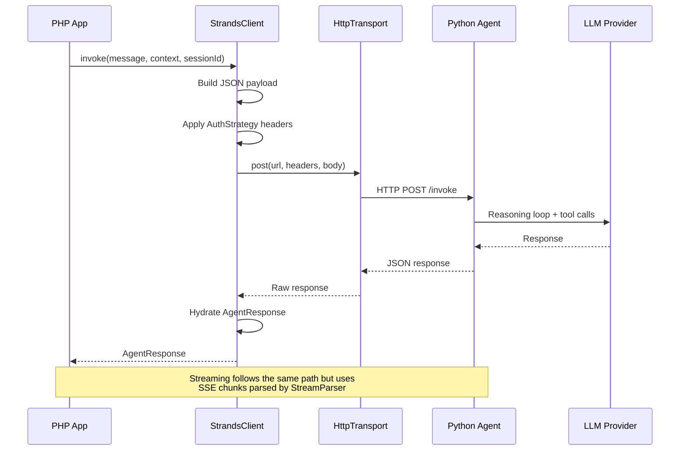

# Strands PHP Client

[](https://github.com/blundergoat/strands-php-client/actions/workflows/ci.yml)
[](https://packagist.org/packages/blundergoat/strands-php-client)
[](https://packagist.org/packages/blundergoat/strands-php-client)
[](https://github.com/blundergoat/strands-php-client/blob/main/LICENSE)

PHP client library for consuming [Strands](https://github.com/strands-agents/strands-agents) AI agents via HTTP. Invoke agents, stream responses via SSE, manage sessions — without running an agentic loop in PHP.

Works with **any PHP framework** — Symfony, Slim, or vanilla PHP.

*"Your PHP app doesn't need to become an AI platform. It just needs to talk to one."*

```
composer require blundergoat/strands-php-client
```

## Why This Exists

[Strands Agents](https://github.com/strands-agents/strands-agents) is an open-source Python SDK from AWS for building autonomous AI agents. It handles the hard parts — reasoning loops, tool orchestration, model routing (Claude, Nova, GPT, Ollama) — and exposes agents over HTTP.

But most web applications aren't written in Python. If your product runs on Symfony or any PHP framework, you need a way to **consume** those agents without reimplementing the agentic loop in PHP. That's what this library does.

Your Python agents handle the AI. Your PHP app handles the product. This client is the bridge.



The request flow in detail:



For a full walkthrough with real-world examples, see the [Usage Guide](docs/usage-guide.md).

## Quick Start

### Symfony (with auto-detection)

If `symfony/http-client` is installed, the transport is auto-detected — just create a client and go:

```php
use Strands\StrandsClient;
use Strands\Config\StrandsConfig;

$client = new StrandsClient(
    config: new StrandsConfig(endpoint: 'http://localhost:8081'),
);

$response = $client->invoke('Should we migrate to microservices?');

echo $response->text;
echo $response->agent;               // Which agent handled it (e.g. "analyst")
echo $response->usage->inputTokens;
```

For Symfony projects, the bundle adds YAML config and autowiring — see [Symfony Bundle Integration](#symfony-bundle-integration) below.

### PSR-18 / Guzzle

Pass a `PsrHttpTransport` with your PSR-18 client:

```php
use Strands\StrandsClient;
use Strands\Config\StrandsConfig;
use Strands\Http\PsrHttpTransport;
use GuzzleHttp\Client;
use GuzzleHttp\Psr7\HttpFactory;

$client = new StrandsClient(
    config: new StrandsConfig(endpoint: 'http://localhost:8081'),
    transport: new PsrHttpTransport(
        httpClient: new Client(['timeout' => 120]),
        requestFactory: new HttpFactory(),
        streamFactory: new HttpFactory(),
    ),
);

$response = $client->invoke('Should we migrate to microservices?');
echo $response->text;
```

### Any PSR-18 Client

Any library implementing PSR-18 (`psr/http-client`) works — Guzzle, Buzz, php-http/curl-client, etc.:

```php
use Strands\Http\PsrHttpTransport;

$transport = new PsrHttpTransport(
    httpClient: $yourPsr18Client,        // ClientInterface
    requestFactory: $yourRequestFactory, // RequestFactoryInterface
    streamFactory: $yourStreamFactory,   // StreamFactoryInterface
);

$client = new StrandsClient(
    config: new StrandsConfig(endpoint: 'https://agent-api.example.com'),
    transport: $transport,
);
```

## Features

### Invoke (blocking)

```php
use Strands\Context\AgentContext;

$response = $client->invoke(
    message: 'Analyse this proposal',
    context: AgentContext::create()
        ->withMetadata('persona', 'analyst')
        ->withSystemPrompt('Be concise.'),
    sessionId: 'session-001',
);

$response->text;        // Agent's response
$response->agent;       // Agent name (e.g. "analyst")
$response->sessionId;   // Session ID for follow-ups
$response->usage;       // Token usage (inputTokens, outputTokens)
$response->toolsUsed;   // Tools the agent called
```

### Stream (SSE)

Real-time token-by-token streaming via Server-Sent Events. Requires `symfony/http-client`.

`stream()` returns a `StreamResult` with the accumulated text, session info, and usage stats:

```php
use Strands\Streaming\StreamEvent;
use Strands\Streaming\StreamEventType;

$result = $client->stream(
    message: 'Explain quantum computing',
    onEvent: function (StreamEvent $event) {
        match ($event->type) {
            StreamEventType::Text     => print($event->text),
            StreamEventType::ToolUse  => print("[Using tool: {$event->toolName}]"),
            StreamEventType::Complete => print("\n[Done]"),
            StreamEventType::Error    => print("Error: {$event->errorMessage}"),
            default                   => null,
        };
    },
    sessionId: 'session-001',
);

echo $result->text;                   // Full accumulated text
echo $result->sessionId;              // Session ID
echo $result->usage->inputTokens;     // Token usage
echo $result->textEvents;             // Number of text chunks received
echo $result->totalEvents;            // Total events received
```

> **Note:** SSE streaming requires `symfony/http-client` via `SymfonyHttpTransport`. PSR-18 clients only support `invoke()` — this is a limitation of the PSR-18 spec, not this library.

### Sessions

The client sends a `session_id` — the server manages all state. Multi-turn conversations just work:

```php
$r1 = $client->invoke('Draft a referral letter', sessionId: 'consult-001');
$r2 = $client->invoke('Make it more formal', sessionId: 'consult-001');
// Server remembers the full conversation
```

### Context Builder

Immutable builder for passing application context to agents:

```php
$context = AgentContext::create()
    ->withMetadata('clinic_id', 'CL-789')
    ->withMetadata('user_role', 'practitioner')
    ->withSystemPrompt('You are a clinical documentation assistant.')
    ->withPermission('read:patients')
    ->withDocument('referral.pdf', base64_encode($pdfBytes), 'application/pdf')
    ->withStructuredData('patient', ['id' => 'P-123', 'age' => 42]);
```

### Logging

`StrandsClient` accepts an optional PSR-3 logger. When provided, it logs request/response details at `debug` level and retries at `warning` level:

```php
use Psr\Log\LoggerInterface;

$client = new StrandsClient(
    config: new StrandsConfig(endpoint: 'http://localhost:8081'),
    logger: $yourLogger,  // Any PSR-3 LoggerInterface
);
```

In the Symfony bundle, the logger is injected automatically from Monolog.

### Retries with Exponential Backoff

Configure automatic retries for transient errors (429, 502, 503, 504):

```php
$config = new StrandsConfig(
    endpoint: 'https://api.example.com/agent',
    maxRetries: 3,          // Retry up to 3 times
    retryDelayMs: 500,      // 500ms → 1000ms → 2000ms (exponential backoff)
    connectTimeout: 5,      // Fail fast if server is down (separate from read timeout)
);
```

Retries apply to `invoke()` calls. Streaming requests are not retried.

## Transport

| Transport | `invoke()` | `stream()` | Dependency |
|-----------|:---:|:---:|------------|
| `SymfonyHttpTransport` | Yes | Yes | `symfony/http-client` |
| `PsrHttpTransport` | Yes | No | Any PSR-18 client |

**Auto-detection:** If no transport is passed to the constructor, the client checks for `symfony/http-client` and uses `SymfonyHttpTransport` automatically. If Symfony isn't available, it throws with guidance to pass a `PsrHttpTransport`.

**Timeout:** `SymfonyHttpTransport` uses the `timeout` from `StrandsConfig` (default 120s). `connectTimeout` (default 10s) controls how long to wait for the initial TCP connection — separate from the read timeout so a down server fails fast without affecting slow LLM generation. For `PsrHttpTransport`, configure timeout on your PSR-18 client directly (e.g. `new GuzzleHttp\Client(['timeout' => 120])`).

## Auth Strategies

| Strategy | Use Case | Status |
|----------|----------|--------|
| `NullAuth` | Local dev via Docker Compose | Available |
| `ApiKeyAuth` | API Gateway / reverse proxy with API keys | Available |
| `SigV4Auth` | AWS service-to-service (IAM) | Planned |

```php
use Strands\Auth\NullAuth;
use Strands\Auth\ApiKeyAuth;

// No auth (default — local development)
$config = new StrandsConfig(
    endpoint: 'http://localhost:8081',
);

// API key auth (production)
$config = new StrandsConfig(
    endpoint: 'https://api.example.com/agent',
    auth: new ApiKeyAuth('sk-your-api-key'),
);

// Custom header (e.g. X-API-Key instead of Authorization: Bearer)
$config = new StrandsConfig(
    endpoint: 'https://api.example.com/agent',
    auth: new ApiKeyAuth('sk-your-api-key', headerName: 'X-API-Key', valuePrefix: ''),
);
```

For details on writing custom auth strategies, see [docs/auth.md](docs/auth.md).

## Symfony Bundle Integration

The Symfony bundle adds YAML config, autowired named agents, and automatic PSR-3 logging:

```yaml
# config/packages/strands.yaml
strands:
    agents:
        analyst:
            endpoint: '%env(AGENT_ENDPOINT)%'
            timeout: 300
        skeptic:
            endpoint: '%env(AGENT_ENDPOINT)%'
            timeout: 300
            auth:
                driver: api_key
                api_key: '%env(AGENT_API_KEY)%'
```

```php
use Strands\StrandsClient;
use Symfony\Component\DependencyInjection\Attribute\Autowire;

class ChatController extends AbstractController
{
    public function __construct(
        #[Autowire(service: 'strands.client.analyst')]
        private readonly StrandsClient $analyst,

        #[Autowire(service: 'strands.client.skeptic')]
        private readonly StrandsClient $skeptic,
    ) {}
}
```

Bundle registration:

```php
// config/bundles.php
return [
    Strands\Integration\Symfony\StrandsBundle::class => ['all' => true],
];
```

For the full configuration reference, see [docs/symfony-config.md](docs/symfony-config.md).

## Requirements

- PHP 8.2+
- One of:
  - `symfony/http-client` ^6.4 or ^7.0 — for full support (invoke + streaming), auto-detected
  - Any PSR-18 HTTP client (e.g. `guzzlehttp/guzzle`) — for invoke only, via `PsrHttpTransport`

## Installation

**Symfony projects:**

```bash
composer require blundergoat/strands-php-client
# symfony/http-client is likely already installed — transport auto-detects
```

**PSR-18 / Guzzle projects:**

```bash
composer require blundergoat/strands-php-client guzzlehttp/guzzle
```

**Want streaming too?**

```bash
composer require blundergoat/strands-php-client symfony/http-client
```

## Documentation

| Document | Description |
|----------|-------------|
| [Usage Guide](docs/usage-guide.md) | Real-world patterns from the-summit-chat |
| [Authentication](docs/auth.md) | Auth strategies, custom drivers, Symfony config |
| [Symfony Config](docs/symfony-config.md) | Full YAML config reference with every option |
| [Changelog](CHANGELOG.md) | Version history and breaking changes |
| [Contributing](CONTRIBUTING.md) | How to set up dev, run tests, submit PRs |

## Testing

```bash
composer install
vendor/bin/phpunit
```

All tests use mocked HTTP responses — no Docker, no API keys, no network calls.

## Related Repos

| Repo | What |
|------|------|
| the-summit-chat | Demo app — three AI agents debating your decisions (coming soon) |
| strands-agent-stack | AWS deployment (Terraform, Fargate, API Gateway) (coming soon) |

## License

Apache 2.0
