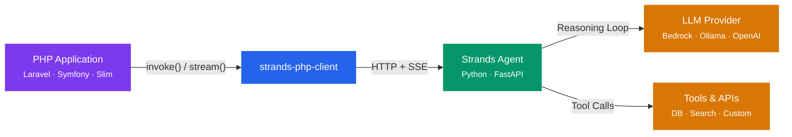

# Strands PHP Client

[](https://github.com/blundergoat/strands-php-client/actions/workflows/ci.yml)
[](https://packagist.org/packages/blundergoat/strands-php-client)
[](https://packagist.org/packages/blundergoat/strands-php-client)
[](https://github.com/blundergoat/strands-php-client/blob/main/LICENSE)

PHP client library for consuming [Strands](https://github.com/strands-agents/strands-agents) AI agents over HTTP. Invoke agents, stream responses via
SSE, and manage sessions without running an agentic loop in PHP.

Works with **any PHP framework** - Laravel, Symfony, Slim, or vanilla PHP.

*"Your PHP app doesn't need to become an AI platform. It just needs to talk to one."*

```
composer require blundergoat/strands-php-client
```

## Why This Exists

[Strands Agents](https://github.com/strands-agents/strands-agents) is an open-source Python SDK from AWS for building autonomous AI agents. It handles
reasoning loops, tool orchestration, and model routing across providers such as Claude, Nova, GPT, and Ollama. Production PHP apps reach those agents
through a small HTTP wrapper.

Most web applications are not written in Python. If your product runs on Symfony or another PHP framework, this library lets it consume those agents
without reimplementing the agentic loop in PHP.

Your Python agents handle the AI. Your PHP app handles the product. This client connects them through the
[Strands HTTP Wire Contract](docs/wire-contract.md), which wrapper services emit instead of exposing raw sdk-python internals.


```mermaid
graph LR
    A["PHP Application<br/><small>Laravel · Symfony · Slim</small>"] -->|"invoke() / stream()"| B["strands-php-client"]
    B -->|"HTTP + SSE"| C["Strands Agent<br/><small>Python · FastAPI</small>"]
    C -->|"Reasoning Loop"| D["LLM Provider<br/><small>Bedrock · Ollama · OpenAI</small>"]
    C -->|"Tool Calls"| E["Tools & APIs<br/><small>DB · Search · Custom</small>"]

    style A fill:#7c3aed,color:#fff,stroke:none
    style B fill:#2563eb,color:#fff,stroke:none
    style C fill:#059669,color:#fff,stroke:none
    style D fill:#d97706,color:#fff,stroke:none
    style E fill:#d97706,color:#fff,stroke:none
```

For a full walkthrough with real-world examples, see the [Usage Guide](docs/usage-guide.md).

Need a Python wrapper to start from? The source repository includes a
[reference FastAPI gateway](https://github.com/blundergoat/strands-php-client/tree/main/examples/python-gateway) with `/invoke`, `/stream`, `/health`,
custom endpoint examples, safe sdk-python normalization, and trace-context continuation. It is reference source, not part of Composer archives.

## Quick Start

### Symfony (with auto-detection)

If `symfony/http-client` is installed, the transport is auto-detected - just create a client and go:

```php
use StrandsPhpClient\Config\StrandsConfig;
use StrandsPhpClient\StrandsClient;

$client = new StrandsClient(
    config: new StrandsConfig(endpoint: 'http://localhost:8081'),
);

$response = $client->invoke('Should we migrate to microservices?');

echo $response->text;
echo $response->agent;               // Which agent handled it (e.g. "analyst")
echo $response->usage->inputTokens;
```

For Symfony projects, the bundle adds YAML config and autowiring - see [Symfony Bundle Integration](#symfony-bundle-integration) below.

### PSR-18 (Guzzle, Buzz, etc.)

Any PSR-18 client works via `PsrHttpTransport` (invoke only, no streaming):

```php
use GuzzleHttp\Client;
use GuzzleHttp\Psr7\HttpFactory;

use StrandsPhpClient\Config\StrandsConfig;
use StrandsPhpClient\Http\PsrHttpTransport;
use StrandsPhpClient\StrandsClient;

$client = new StrandsClient(
    config: new StrandsConfig(endpoint: 'http://localhost:8081'),
    transport: new PsrHttpTransport(
        httpClient: new Client(['timeout' => 120]),
        requestFactory: new HttpFactory(),
        streamFactory: new HttpFactory(),
    ),
);

$response = $client->invoke('Should we migrate to microservices?');
echo $response->text;
```

## Features

### Rich Input (AgentInput)

Send multi-modal content to agents - images, documents, S3 locations - alongside your text message:

```php
use StrandsPhpClient\Context\AgentInput;

// Text with an image
$imageInput = AgentInput::text("What's in this image?")
    ->withImage(base64_encode($imageBytes), 'image/png');

$imageResponse = $client->invoke(message: $imageInput);

// Text with a document from S3
$documentInput = AgentInput::text('Summarise this report')
    ->withCachePoint(ttl: '5m')
    ->withDocumentFromS3Options(
        s3Uri: 's3://my-bucket/report.pdf',
        format: 'pdf',
        name: 'report',
        context: 'Quarterly operating report.',
        citations: ['enabled' => true],
    );

// After an earlier call returned this InterruptDetail, resume the exact pause the user approved and fall back to its tool-use ID when needed.
$resumeInput = $interrupt->toResumeInput(['approved' => true]);
```

When no content blocks are attached, `AgentInput::text()` serializes as a plain string for backward compatibility. See the
[rich-input guide](docs/rich-input.md) for the full API reference.

### Invoke (blocking)

```php
use StrandsPhpClient\Context\AgentContext;

$response = $client->invoke(
    message: 'Analyse this proposal',
    context: AgentContext::create()
        ->withMetadata('persona', 'analyst')
        ->withSystemPrompt('Be concise.'),
    sessionId: 'session-001',
);

$response->text;                         // Agent's response
$response->agent;                        // Agent name (e.g. "analyst")
$response->sessionId;                    // Session ID for follow-ups
$response->usage;                        // Token usage (inputTokens, outputTokens)
$response->usage->totalTokens();         // Total tokens (input + output)
$response->toolsUsed;                    // Tools the agent called
$response->metadata;                     // Unknown fields plus deprecated 1.x aliases
$response->wrapperMetadata;              // Canonical top-level wrapper-owned metadata
$response->message?->metadata?->custom;  // Nested message metadata
$response->contextSize;                  // Current context size when emitted
$response->rawStopReason;                // Original stop_reason string

// An interrupted turn becomes one or more approval controls instead of a final answer.
if ($response->isInterrupted()) {
    // Each interrupt explains one tool action the user can approve or deny.
    foreach ($response->interrupts as $interrupt) {
        echo $interrupt->toolName;       // Tool that needs approval
        echo $interrupt->reason;         // Why the agent paused
    }
}

// Guardrail traces (content safety)
if ($response->guardrailTrace !== null) {
    echo $response->guardrailTrace->action;  // 'INTERVENED' or 'NONE'
}
```

For 1.x compatibility, promoted metadata fields remain readable through both paths. New code uses `$wrapperMetadata`, `$contextSize`, and
`$projectedContextSize`; `$metadata['metadata']`, `$metadata['context_size']`, and `$metadata['projected_context_size']` remain deprecated until 2.0.
Usage timing properties also remain integers in 1.x; fractional wire values round to the nearest millisecond instead of silently becoming zero.

### Stream (SSE)

Real-time token-by-token streaming via Server-Sent Events. Requires `symfony/http-client`.

`stream()` returns a `StreamResult` with the accumulated text, session info, and usage stats:

```php
use StrandsPhpClient\Streaming\StreamEvent;
use StrandsPhpClient\Streaming\StreamEventType;

$result = $client->stream(
    message: 'Explain quantum computing',
    onEvent: function (StreamEvent $event) {
        // Event types without visible chat output return null so streaming continues.
        match ($event->type) {
            StreamEventType::Text     => print($event->text),
            StreamEventType::ToolUse  => print("[Using tool: {$event->toolName}]"),
            StreamEventType::Complete => print("\n[Done]"),
            StreamEventType::Error    => print("Error: {$event->errorMessage}"),
            default                   => null,
        };
    },
    sessionId: 'session-001',
);

echo $result->text;                          // Full accumulated text
echo $result->sessionId;                     // Session ID
echo $result->usage->inputTokens;            // Token usage
echo $result->usage->totalTokens();          // Total tokens (input + output)
echo $result->textEvents;                    // Number of text chunks received
echo $result->totalEvents;                   // All parsed events, including thinking, tools, citations, and terminal events
echo $result->timeToFirstTextTokenMs;        // Client-measured TTFT in ms
echo $result->stopReason?->value;             // Known typed stop reason, when recognised
echo $result->rawStopReason;                  // Exact stop_reason, including future values
echo $result->isInterrupted() ? 'yes' : 'no'; // Whether the agent was interrupted
```

> **Note:** SSE streaming requires `symfony/http-client` through `SymfonyHttpTransport`. PSR-18 clients support only `invoke()` because PSR-18 has no
> streaming response contract.

### Custom Endpoints (postJson / streamSse)

For agent endpoints with custom request and response schemas, use `postJson()` and `streamSse()`. They bypass the standard `/invoke` and `/stream`
contract and preserve app-owned payloads:

```php
// Synchronous - returns raw decoded JSON array
$result = $client->postJson('/file-summarise', [
    'file_base64' => base64_encode($fileBytes),
    'file_name' => 'report.pdf',
], timeout: 120);

// Streaming - delivers raw decoded JSON arrays to the callback
$client->streamSse('/file-summarise-stream', [
    'file_base64' => base64_encode($fileBytes),
], function (array $event) {
    // A missing or app-specific event type produces no visible output but does not stop the stream.
    match ($event['type'] ?? '') {
        'text'     => print($event['content']),
        'complete' => print("\n[Done]"),
        default    => null,
    };
}, timeout: 120);
```

Both methods accept optional `timeout:` overrides and stream callbacks can return `false` to cancel.

### Error Handling

`AgentErrorException` carries the full response body for debugging structured errors:

```php
use StrandsPhpClient\Exceptions\AgentErrorException;

try {
    $client->postJson('/validate', $payload);
} catch (AgentErrorException $agentError) {
    // For example, a validation screen may receive structured field errors from a custom 422 response.
    $agentError->statusCode;    // 422
    $agentError->getMessage();  // "Validation failed"
    $agentError->responseBody;  // ['detail' => '...', 'errors' => [...]]
}
```

### Sessions & Context

Pass `sessionId` for multi-turn conversations - the server manages all state:

```php
$draftResponse = $client->invoke('Draft a referral letter', sessionId: 'consult-001');
$revisedResponse = $client->invoke('Make it more formal', sessionId: 'consult-001');
```

Use the immutable `AgentContext` builder to pass application context:

```php
$context = AgentContext::create()
    ->withMetadata('clinic_id', 'CL-789')
    ->withSystemPrompt('You are a clinical documentation assistant.')
    ->withPermission('read:patients')
    ->withDocument('referral.pdf', base64_encode($pdfBytes), 'application/pdf');
```

### Retries, Timeouts & Logging

```php
$config = new StrandsConfig(
    endpoint: 'https://api.example.com/agent',
    maxRetries: 3,          // Retry up to 3 times (invoke/postJson only)
    retryDelayMs: 500,      // Base waits are 500ms → 1s → 2s; each actual wait is randomized to 50–100%
    connectTimeout: 5,      // Fail fast if server is down
);

$client = new StrandsClient(config: $config, logger: $yourPsr3Logger);
```

Retries apply to `invoke()` and `postJson()`. Streaming requests are not retried. The Symfony bundle injects Monolog automatically.

### Distributed Tracing (OpenTelemetry)

The `OtelTracingMiddleware` emits a `KIND_CLIENT` span for each `invoke()`, `stream()`, `postJson()`, or `streamSse()` call. It injects W3C
`traceparent` and `tracestate` headers so the agent service can continue the distributed trace. It adds no runtime work when it is not configured.

```bash
composer require open-telemetry/api open-telemetry/sdk open-telemetry/exporter-otlp
```

```php
use StrandsPhpClient\Http\Middleware\OtelTracingMiddleware;

$client = new StrandsClient(
    config: $config,
    middleware: [OtelTracingMiddleware::create($tracer)],
);
```

This middleware does **not** capture request or response content on spans. Token counts and model-level tracing come from the server-side Strands SDK.
See the [W3C Trace Context specification](https://www.w3.org/TR/trace-context/).

The middleware uses the local `strands-otel-v1` attribute policy. It records the operation, sanitized route, response status, token counts, stop
reason, stream event counts, tool names, and whether a session is present.

It does not record prompts, responses, filenames, raw context metadata, document content, citation text, tool payloads, credentials, session IDs, or
unsanitized exception messages.

For Python wrapper trace continuation, copy the FastAPI middleware from the
[source-repository gateway](https://github.com/blundergoat/strands-php-client/blob/main/examples/python-gateway/tracing.py).

> **Concurrency note:** The middleware uses a LIFO stack for span and scope tracking. It supports synchronous PHP-FPM, not Fibers or coroutines.

### Stream Callback Handler

`StreamCallbackHandler` dispatches stream events to typed methods, replacing manual event-type switch logic:

```php
use StrandsPhpClient\Streaming\PrintingCallbackHandler;

$result = $client->stream('Hello', new PrintingCallbackHandler());
```

For custom handling, extend `StreamCallbackHandler` and override the methods you need:

```php
use StrandsPhpClient\Streaming\StreamCallbackHandler;
use StrandsPhpClient\Streaming\StreamEvent;

/**
 * Renders live answer text and pauses before tool activity continues.
 *
 * Use this handler when a chat screen displays tokens but moves tool calls into a separate approval flow.
 * Returning null keeps text streaming, while returning false closes the current HTTP stream.
 */
final class ChatStreamHandler extends StreamCallbackHandler
{
    /** Add the newest text chunk to the answer already visible in the chat screen. */
    protected function onText(StreamEvent $event): ?bool
    {
        echo $event->text;

        // Null tells the client to keep receiving text for the answer currently on screen.
        return null;
    }

    /** Stop the live request so the app can show its tool-approval UI. */
    protected function onToolUse(StreamEvent $event): ?bool
    {
        return false;
    }
}
```

## Transport

| Transport | `invoke()` | `stream()` | Dependency |
|-----------|:---:|:---:|------------|
| `SymfonyHttpTransport` | Yes | Yes | `symfony/http-client` |
| `PsrHttpTransport` | Yes | No | Any PSR-18 client |

**Auto-detection:** If no transport is passed to the constructor, the client uses `SymfonyHttpTransport` when `symfony/http-client` is installed.
Otherwise, it throws with guidance to pass a `PsrHttpTransport`.

**Timeout:** `SymfonyHttpTransport` uses the `StrandsConfig` response timeout (120 seconds by default). Its `connectTimeout` controls the initial TCP
connection separately, so an unreachable server fails without shortening a valid long-running response. `PsrHttpTransport` cannot apply these values;
configure timeouts on the PSR-18 client itself, such as `new GuzzleHttp\Client(['timeout' => 120])`.

## Auth Strategies

| Strategy | Use Case | Status |
|----------|----------|--------|
| `NullAuth` | Local dev via Docker Compose | Available |
| `ApiKeyAuth` | API Gateway / reverse proxy with API keys | Available |
| `SigV4Auth` | AWS service-to-service (IAM) | Available |

```php
use StrandsPhpClient\Auth\ApiKeyAuth;
use StrandsPhpClient\Auth\SigV4Auth;
use StrandsPhpClient\Config\StrandsConfig;

// No auth (default - local development)
$config = new StrandsConfig(
    endpoint: 'http://localhost:8081',
);

// API key auth (production)
$config = new StrandsConfig(
    endpoint: 'https://api.example.com/agent',
    auth: new ApiKeyAuth('sk-your-api-key'),
);

// Custom header (e.g. X-API-Key instead of Authorization: Bearer)
$config = new StrandsConfig(
    endpoint: 'https://api.example.com/agent',
    auth: new ApiKeyAuth('sk-your-api-key', headerName: 'X-API-Key', valuePrefix: ''),
);

// AWS SigV4 auth (agents behind API Gateway with IAM)
$config = new StrandsConfig(
    endpoint: 'https://abc123.execute-api.us-east-1.amazonaws.com/prod',
    auth: new SigV4Auth(
        accessKeyId: 'your-access-key-id',
        secretAccessKey: 'your-secret-access-key',
        region: 'us-east-1',
    ),
);

// SigV4 from environment variables (AWS_ACCESS_KEY_ID, AWS_SECRET_ACCESS_KEY)
$config = new StrandsConfig(
    endpoint: 'https://abc123.execute-api.us-east-1.amazonaws.com/prod',
    auth: SigV4Auth::fromEnvironment(region: 'us-east-1'),
);
```

`fromEnvironment()` reads only the two required AWS key variables and optional `AWS_SESSION_TOKEN`. For an instance profile, ECS task role, or Lambda
execution role, resolve credentials with an AWS provider and pass the values to `SigV4Auth`.

For details on writing custom auth strategies, see the [authentication guide](docs/auth.md).

## Symfony Bundle Integration

The Symfony bundle adds YAML config, autowired named agents, and automatic PSR-3 logging:

```yaml
# config/packages/strands.yaml
strands:
    agents:
        analyst:
            endpoint: '%env(AGENT_ENDPOINT)%'
            timeout: 300
        skeptic:
            endpoint: '%env(AGENT_ENDPOINT)%'
            timeout: 300
            auth:
                driver: api_key
                api_key: '%env(AGENT_API_KEY)%'
```

```php
use Symfony\Component\DependencyInjection\Attribute\Autowire;

use StrandsPhpClient\StrandsClient;

/**
 * Receives the named agents used by a Symfony chat screen.
 *
 * Use this controller when one user flow can ask either the analyst or skeptic for an answer.
 * Its action methods can select the appropriate client without looking up services at runtime.
 */
final class ChatController extends AbstractController
{
    /** Inject the two named agents available to this chat screen. */
    public function __construct(
        #[Autowire(service: 'strands.client.analyst')]
        private readonly StrandsClient $analyst,

        #[Autowire(service: 'strands.client.skeptic')]
        private readonly StrandsClient $skeptic,
    ) {
    }
}
```

Bundle registration:

```php
// config/bundles.php
return [
    StrandsPhpClient\Integration\Symfony\StrandsBundle::class => ['all' => true],
];
```

For the full configuration reference, see [docs/symfony-config.md](docs/symfony-config.md).

## Laravel Integration

The Laravel service provider adds config-driven agent registration, dependency injection, and a facade:

```php
// config/strands.php (publish with: php artisan vendor:publish --tag=strands-config)
return [
    'default' => env('STRANDS_DEFAULT_AGENT', 'default'),

    'agents' => [
        'default' => [
            'endpoint' => env('STRANDS_ENDPOINT', 'http://localhost:8081'),
            'auth' => [
                // A missing driver uses unauthenticated local access; select api_key before supplying the optional secret below.
                'driver' => env('STRANDS_AUTH_DRIVER', 'null'),
                'api_key' => env('STRANDS_API_KEY'),
            ],
            'timeout' => (int) env('STRANDS_TIMEOUT', 120),
        ],
        'analyst' => [
            'endpoint' => env('AGENT_ENDPOINT'),
            'auth' => ['driver' => 'api_key', 'api_key' => env('AGENT_API_KEY')],
            'timeout' => 300,
        ],
    ],
];
```

Inject by type-hint or resolve named agents:

```php
use StrandsPhpClient\StrandsClient;

/**
 * Receives the default agent used by a Laravel chat screen.
 *
 * Use this controller for chat actions that share the application's configured default agent.
 * Resolve a named client separately when a screen needs a specialist agent.
 */
final class ChatController extends Controller
{
    /** Inject the default agent configured for Laravel requests. */
    public function __construct(
        private readonly StrandsClient $defaultAgentClient,
    ) {
    }
}

// Named agent via container
$analyst = app('strands.client.analyst');
```

Use the facade for quick calls:

```php
use StrandsPhpClient\Integration\Laravel\Facades\Strands;

$response = Strands::invoke('Analyse this proposal');
```

Auto-discovery is configured via `composer.json` - no manual provider registration needed.

For the full configuration reference, see [docs/laravel-config.md](docs/laravel-config.md).

## Requirements

- PHP 8.2 or newer. The Composer constraint is `>=8.2`; CI currently exercises PHP 8.2, 8.3, and 8.4.
- One of:
  - `symfony/http-client` ^6.4, ^7.0, or ^8.0 - for full support (invoke + streaming), auto-detected
  - Any PSR-18 HTTP client (e.g. `guzzlehttp/guzzle`) - for invoke only, via `PsrHttpTransport`

CI exercises Symfony ^6.4 and ^7.0. Symfony 8 is allowed but is not yet covered by the test matrix. See
[What CI covers](CONTRIBUTING.md#what-ci-covers) for the compatibility policy.

## Installation

**Laravel projects:**

```bash
composer require blundergoat/strands-php-client
php artisan vendor:publish --tag=strands-config
```

**Symfony projects:**

```bash
composer require blundergoat/strands-php-client
# symfony/http-client is likely already installed - transport auto-detects
```

**PSR-18 / Guzzle projects:**

```bash
composer require blundergoat/strands-php-client guzzlehttp/guzzle
```

**Want streaming too?**

```bash
composer require blundergoat/strands-php-client symfony/http-client
```

## Documentation

| Document | Description |
|----------|-------------|
| [Usage Guide](docs/usage-guide.md) | Real-world patterns and examples |
| [Wire Contract](docs/wire-contract.md) | Canonical JSON/SSE contract for wrapper services |
| [Wire Contract Audit](docs/wire-contract-audit.md) | Active wrapper-service conformance notes |
| [Authentication](docs/auth.md) | Auth strategies, custom drivers, framework config |
| [Rich Input](docs/rich-input.md) | Multi-modal input: images, documents, videos, S3 and URL sources |
| [Interrupts & Guardrails](docs/interrupts-and-guardrails.md) | Human-in-the-loop and content safety |
| [Laravel Config](docs/laravel-config.md) | Full PHP config reference with every option |
| [Symfony Config](docs/symfony-config.md) | Full YAML config reference with every option |
| [Changelog](CHANGELOG.md) | Version history and breaking changes |
| [Contributing](CONTRIBUTING.md) | How to set up dev, run tests, submit PRs |

## Testing

```bash
composer install
vendor/bin/phpunit
```

All tests use mocked HTTP responses - no Docker, no API keys, no network calls.

## Related

| Repo | What                                                 |
|------|------------------------------------------------------|
| [the-summit-chatroom](https://github.com/blundergoat/the-summit-chatroom) | Demo app - three AI agents debating your decisions   |
| [terraform-aws-strands](https://github.com/blundergoat/terraform-aws-strands) | Terraform module for deploying Strands agents on AWS |

Maintained by [Matthew Hansen](https://www.blundergoat.com/about).
