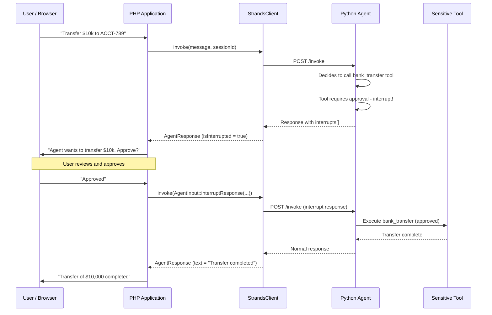
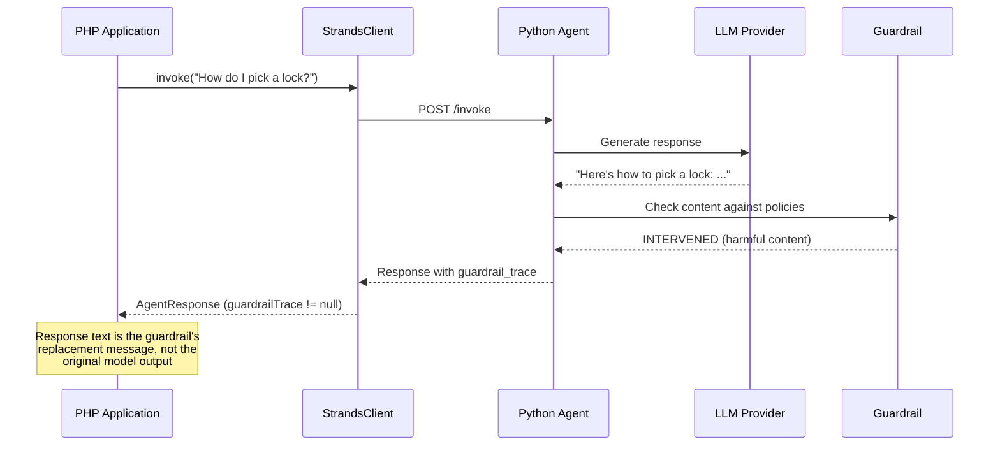

# Interrupts and Guardrails

This guide covers two mechanisms for controlling agent behavior: **interrupts** (human-in-the-loop approval) and **guardrails** (content safety filters). Both are supported in `invoke()` and `stream()` responses.

## Table of Contents

- [Interrupts (Human-in-the-Loop)](#interrupts-human-in-the-loop)
  - [What Are Interrupts?](#what-are-interrupts)
  - [Interrupt Flow](#interrupt-flow)
  - [Detecting Interrupts (invoke)](#detecting-interrupts-invoke)
  - [Detecting Interrupts (stream)](#detecting-interrupts-stream)
  - [Resuming After an Interrupt](#resuming-after-an-interrupt)
  - [InterruptDetail Reference](#interruptdetail-reference)
- [Guardrails (Content Safety)](#guardrails-content-safety)
  - [What Are Guardrails?](#what-are-guardrails)
  - [Guardrail Flow](#guardrail-flow)
  - [Inspecting Guardrail Traces (invoke)](#inspecting-guardrail-traces-invoke)
  - [Inspecting Guardrail Traces (stream)](#inspecting-guardrail-traces-stream)
  - [GuardrailTrace Reference](#guardrailtrace-reference)
- [Combined Example](#combined-example)

## Interrupts (Human-in-the-Loop)

### What Are Interrupts?

When an agent's tool is configured to require user approval before executing (e.g., transferring money, deleting data, sending an email), the agent **interrupts** its execution and returns control to the caller. The PHP application can then present the pending action to the user, collect their decision, and resume the conversation.

This is a key pattern for building safe, auditable AI applications where certain actions require human oversight.

### Interrupt Flow



### Detecting Interrupts (invoke)

```php
use StrandsPhpClient\StrandsClient;
use StrandsPhpClient\Config\StrandsConfig;

$client = new StrandsClient(
    config: new StrandsConfig(endpoint: 'http://localhost:8081'),
);

$response = $client->invoke(
    message: 'Transfer $10,000 from savings to account ACCT-789',
    sessionId: 'session-001',
);

// Check if the agent was interrupted
if ($response->isInterrupted()) {
    foreach ($response->interrupts as $interrupt) {
        echo "Tool: {$interrupt->toolName}\n";
        echo "Reason: {$interrupt->reason}\n";
        echo "Interrupt ID: {$interrupt->interruptId}\n";
        echo "Tool Use ID: {$interrupt->toolUseId}\n";

        // The input the tool would have been called with
        echo "Proposed action:\n";
        print_r($interrupt->toolInput);
        // ['amount' => 10000, 'from' => 'savings', 'to' => 'ACCT-789']
    }
} else {
    // Normal response - no approval needed
    echo $response->text;
}
```

### Detecting Interrupts (stream)

Interrupt data arrives in the `Complete` event and is surfaced on the `StreamResult`:

```php
use StrandsPhpClient\Streaming\StreamEvent;
use StrandsPhpClient\Streaming\StreamEventType;

$result = $client->stream(
    message: 'Delete all expired user accounts',
    onEvent: function (StreamEvent $event) {
        match ($event->type) {
            StreamEventType::Text     => print($event->text),
            StreamEventType::ToolUse  => print("[Calling: {$event->toolName}]\n"),
            StreamEventType::Complete => print("\n[Stream complete]\n"),
            default                   => null,
        };
    },
    sessionId: 'session-001',
);

if ($result->isInterrupted()) {
    foreach ($result->interrupts as $interrupt) {
        echo "Needs approval: {$interrupt->toolName}\n";
        echo "Reason: {$interrupt->reason}\n";
    }
}
```

### Resuming After an Interrupt

Use `AgentInput::interruptResponse()` to send the user's decision back to the agent. The session ID must match the original request so the agent can continue from where it left off.

```php
use StrandsPhpClient\Context\AgentInput;

// User approved the action
$input = AgentInput::interruptResponse(
    interruptId: $interrupt->interruptId,
    response: ['approved' => true],
);

$response = $client->invoke(
    message: $input,
    sessionId: 'session-001', // Same session
);

echo $response->text;
// "Successfully transferred $10,000 from savings to account ACCT-789."
```

To deny the action:

```php
$input = AgentInput::interruptResponse(
    interruptId: $interrupt->interruptId,
    response: ['approved' => false, 'reason' => 'Amount too high'],
);

$response = $client->invoke(
    message: $input,
    sessionId: 'session-001',
);

echo $response->text;
// "Understood. The transfer has been cancelled. Would you like to try a smaller amount?"
```

### InterruptDetail Reference

`InterruptDetail` is a readonly value object with the following properties:

| Property | Type | Description |
|----------|------|-------------|
| `toolName` | `string` | The tool that raised the interrupt. |
| `toolInput` | `array<string, mixed>` | The input/arguments the tool was called with. |
| `toolUseId` | `?string` | Unique ID for the tool invocation. |
| `interruptId` | `?string` | Server-assigned interrupt identifier (used for resume). |
| `reason` | `?string` | Human-readable reason for the interrupt. |

## Guardrails (Content Safety)

### What Are Guardrails?

Guardrails are server-side content safety filters that inspect the model's output before it reaches the caller. When a guardrail determines that the content violates a policy (e.g., harmful content, PII exposure, off-topic response), it can **intervene** by replacing or blocking the output.

The PHP client surfaces the guardrail's trace data so your application can understand what happened and react accordingly.

### Guardrail Flow



### Inspecting Guardrail Traces (invoke)

```php
$response = $client->invoke(
    message: 'How do I pick a lock?',
    sessionId: 'session-001',
);

echo $response->text;
// "I'm sorry, I can't help with that request."

if ($response->guardrailTrace !== null) {
    $trace = $response->guardrailTrace;

    echo "Action: {$trace->action}\n";
    // 'INTERVENED' - the guardrail blocked or modified the output
    // 'NONE' - the guardrail checked but took no action

    // Detailed assessments from each guardrail rule
    foreach ($trace->assessments as $assessment) {
        print_r($assessment);
        // [
        //     'guardrail_id' => 'content-safety-v1',
        //     'topic' => 'HARMFUL_CONTENT',
        //     'action' => 'BLOCKED',
        //     'confidence' => 'HIGH',
        // ]
    }

    // The model's original output before intervention (if available)
    if ($trace->modelOutput !== null) {
        echo "Original output was: {$trace->modelOutput}\n";
    }
}
```

### Inspecting Guardrail Traces (stream)

Guardrail trace data arrives in the `Complete` event and is surfaced on the `StreamResult`:

```php
use StrandsPhpClient\Streaming\StreamEvent;
use StrandsPhpClient\Streaming\StreamEventType;

$result = $client->stream(
    message: 'Tell me about restricted topics',
    onEvent: function (StreamEvent $event) {
        match ($event->type) {
            StreamEventType::Text     => print($event->text),
            StreamEventType::Complete => print("\n[Done]\n"),
            default                   => null,
        };
    },
);

if ($result->guardrailTrace !== null) {
    echo "Guardrail action: {$result->guardrailTrace->action}\n";

    foreach ($result->guardrailTrace->assessments as $assessment) {
        echo "Rule: " . ($assessment['guardrail_id'] ?? 'unknown') . "\n";
        echo "Action: " . ($assessment['action'] ?? 'unknown') . "\n";
    }
}
```

### GuardrailTrace Reference

`GuardrailTrace` is a readonly value object with the following properties:

| Property | Type | Description |
|----------|------|-------------|
| `action` | `string` | The guardrail action: `'INTERVENED'` (blocked/modified) or `'NONE'` (passed). |
| `assessments` | `list<array<string, mixed>>` | Individual guardrail rule assessments. |
| `modelOutput` | `?string` | The model's original output before intervention. |

The `assessments` array contains raw guardrail data from the server. The exact structure depends on the guardrail implementation on the Python side. Common fields include `guardrail_id`, `topic`, `action`, and `confidence`.

**Parsing note:** The PHP client looks for guardrail trace data in two locations:
1. Top-level `guardrail_trace` field in the response.
2. Nested `trace.guardrail` field (alternative format).

Both are supported transparently.

## Combined Example

A real-world handler that checks for both interrupts and guardrails:

```php
use StrandsPhpClient\Context\AgentInput;
use StrandsPhpClient\Response\AgentResponse;
use StrandsPhpClient\StrandsClient;

function handleAgentResponse(
    StrandsClient $client,
    string $message,
    string $sessionId,
): array {
    $response = $client->invoke(
        message: $message,
        sessionId: $sessionId,
    );

    // Check guardrails first - if content was blocked, don't proceed
    if ($response->guardrailTrace !== null && $response->guardrailTrace->action === 'INTERVENED') {
        return [
            'status' => 'blocked',
            'text' => $response->text, // Guardrail's replacement message
            'guardrail' => $response->guardrailTrace->action,
        ];
    }

    // Check for interrupts - agent needs user approval
    if ($response->isInterrupted()) {
        $pendingActions = [];

        foreach ($response->interrupts as $interrupt) {
            $pendingActions[] = [
                'interrupt_id' => $interrupt->interruptId,
                'tool' => $interrupt->toolName,
                'reason' => $interrupt->reason,
                'input' => $interrupt->toolInput,
            ];
        }

        return [
            'status' => 'needs_approval',
            'pending_actions' => $pendingActions,
        ];
    }

    // Normal response
    return [
        'status' => 'complete',
        'text' => $response->text,
        'tokens' => $response->usage->totalTokens(),
    ];
}
```
