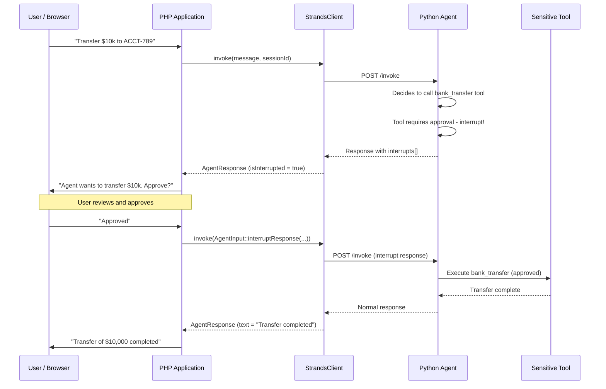
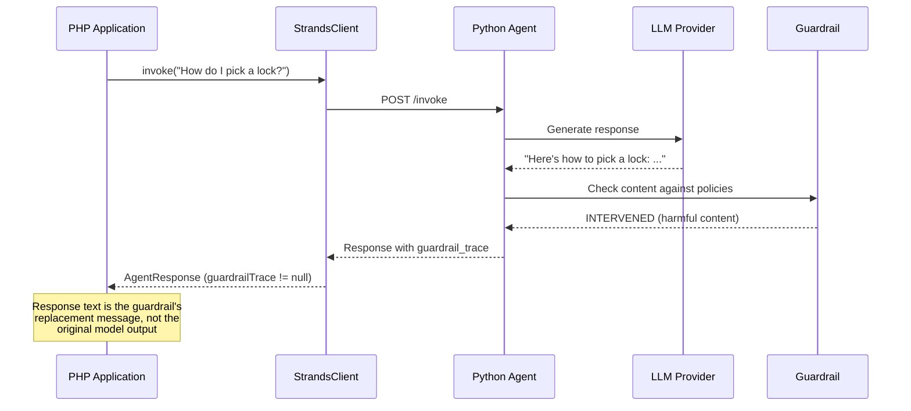

# Interrupts and Guardrails

This guide covers two controls around an agent response: **interrupts** pause an action for human approval, while **guardrails** report content-safety
decisions. Both are available on `invoke()` and `stream()` results.

## Table of Contents

- [Interrupts (Human-in-the-Loop)](#interrupts-human-in-the-loop)
  - [What Are Interrupts?](#what-are-interrupts)
  - [Interrupt Flow](#interrupt-flow)
  - [Detecting Interrupts (invoke)](#detecting-interrupts-invoke)
  - [Detecting Interrupts (stream)](#detecting-interrupts-stream)
  - [Resuming After an Interrupt](#resuming-after-an-interrupt)
  - [InterruptDetail Reference](#interruptdetail-reference)
- [Guardrails (Content Safety)](#guardrails-content-safety)
  - [What Are Guardrails?](#what-are-guardrails)
  - [Guardrail Flow](#guardrail-flow)
  - [Inspecting Guardrail Traces (invoke)](#inspecting-guardrail-traces-invoke)
  - [Inspecting Guardrail Traces (stream)](#inspecting-guardrail-traces-stream)
  - [GuardrailTrace Reference](#guardrailtrace-reference)
- [Combined Example](#combined-example)

## Interrupts (Human-in-the-Loop)

### What Are Interrupts?

When a tool requires approval before transferring money, deleting data, sending an email, or taking another sensitive action, the agent interrupts its
turn. The PHP application shows the proposed action, collects the decision, and resumes the same conversation.

This is a key pattern for building safe, auditable AI applications where certain actions require human oversight.

### Interrupt Flow


```mermaid
sequenceDiagram
    participant User as User / Browser
    participant App as PHP Application
    participant Client as StrandsClient
    participant Agent as Python Agent
    participant Tool as Sensitive Tool

    User->>App: "Transfer $10k to ACCT-789"
    App->>Client: invoke(message, sessionId)
    Client->>Agent: POST /invoke
    Agent->>Agent: Decides to call bank_transfer tool
    Agent->>Agent: Tool requires approval - interrupt!
    Agent-->>Client: Response with interrupts[]
    Client-->>App: AgentResponse (isInterrupted = true)

    App->>User: "Agent wants to transfer $10k. Approve?"

    Note over User,App: User reviews and approves

    User->>App: "Approved"
    App->>Client: invoke(AgentInput::interruptResponse(...))
    Client->>Agent: POST /invoke (interrupt response)
    Agent->>Tool: Execute bank_transfer (approved)
    Tool-->>Agent: Transfer complete
    Agent-->>Client: Normal response
    Client-->>App: AgentResponse (text = "Transfer completed")
    App->>User: "Transfer of $10,000 completed"
```

### Detecting Interrupts (invoke)

```php
use StrandsPhpClient\Config\StrandsConfig;
use StrandsPhpClient\StrandsClient;

$client = new StrandsClient(
    config: new StrandsConfig(endpoint: 'http://localhost:8081'),
);

$response = $client->invoke(
    message: 'Transfer $10,000 from savings to account ACCT-789',
    sessionId: 'session-001',
);

// An interrupted turn becomes one or more approval controls instead of a final answer.
if ($response->isInterrupted()) {
    // Each interrupt explains one tool action the user can approve or deny.
    foreach ($response->interrupts as $interrupt) {
        echo "Tool: {$interrupt->toolName}\n";
        echo "Reason: {$interrupt->reason}\n";
        echo "Interrupt ID: {$interrupt->interruptId}\n";
        echo "Tool Use ID: {$interrupt->toolUseId}\n";

        // The input the tool would have been called with
        echo "Proposed action:\n";
        print_r($interrupt->toolInput);
        // ['amount' => 10000, 'from' => 'savings', 'to' => 'ACCT-789']
    }
} else {
    // Normal response - no approval needed
    echo $response->text;
}
```

### Detecting Interrupts (stream)

Interrupt data arrives in the `Complete` event and is surfaced on the `StreamResult`:

```php
use StrandsPhpClient\Streaming\StreamEvent;
use StrandsPhpClient\Streaming\StreamEventType;

$result = $client->stream(
    message: 'Delete all expired user accounts',
    onEvent: function (StreamEvent $event) {
        // Event types without visible approval-screen output return null so streaming continues.
        match ($event->type) {
            StreamEventType::Text     => print($event->text),
            StreamEventType::ToolUse  => print("[Calling: {$event->toolName}]\n"),
            StreamEventType::Complete => print("\n[Stream complete]\n"),
            default                   => null,
        };
    },
    sessionId: 'session-001',
);

// A terminal interrupt becomes the approval state shown after live output stops.
if ($result->isInterrupted()) {
    // Each interrupt describes one tool action awaiting the user's decision.
    foreach ($result->interrupts as $interrupt) {
        echo "Needs approval: {$interrupt->toolName}\n";
        echo "Reason: {$interrupt->reason}\n";
    }
}
```

### Resuming After an Interrupt

Call `InterruptDetail::toResumeInput()` with the user's decision. It prefers `interruptId`, falls back to `toolUseId`, and rejects the response when
neither exists. Send the result with the same session ID so the agent can continue the paused conversation.

```php
// User approved the action
$resumeInput = $interrupt->toResumeInput(['approved' => true]);

$response = $client->invoke(
    message: $resumeInput,
    sessionId: 'session-001', // Same session
);

echo $response->text;
// "Successfully transferred $10,000 from savings to account ACCT-789."
```

To deny the action:

```php
$resumeInput = $interrupt->toResumeInput([
    'approved' => false,
    'reason' => 'Amount too high',
]);

$response = $client->invoke(
    message: $resumeInput,
    sessionId: 'session-001',
);

echo $response->text;
// "Understood. The transfer has been cancelled. Would you like to try a smaller amount?"
```

### InterruptDetail Reference

`InterruptDetail` is a readonly value object with the following properties:

| Property | Type | Description |
|----------|------|-------------|
| `toolName` | `string` | The tool that raised the interrupt. |
| `toolInput` | `array<string, mixed>` | The input/arguments the tool was called with. |
| `toolUseId` | `?string` | Unique ID for the tool invocation. |
| `interruptId` | `?string` | Server-assigned interrupt identifier (used for resume). |
| `reason` | `?string` | Human-readable reason for the interrupt. |

## Guardrails (Content Safety)

### What Are Guardrails?

Guardrails are server-side filters that inspect model output before it reaches the caller. A policy can intervene when it detects harmful content,
personal information, an off-topic answer, or another configured condition. The visible response text is the wrapper's allowed replacement.

The PHP client surfaces the guardrail's trace data so your application can understand what happened and react accordingly.

### Guardrail Flow


```mermaid
sequenceDiagram
    participant App as PHP Application
    participant Client as StrandsClient
    participant Agent as Python Agent
    participant LLM as LLM Provider
    participant Guard as Guardrail

    App->>Client: invoke("How do I pick a lock?")
    Client->>Agent: POST /invoke
    Agent->>LLM: Generate response
    LLM-->>Agent: "Here's how to pick a lock: ..."
    Agent->>Guard: Check content against policies
    Guard-->>Agent: INTERVENED (harmful content)
    Agent-->>Client: Response with guardrail_trace
    Client-->>App: AgentResponse (guardrailTrace != null)

    Note over App: Response text is the guardrail's<br/>replacement message, not the<br/>original model output
```

### Inspecting Guardrail Traces (invoke)

```php
$response = $client->invoke(
    message: 'How do I pick a lock?',
    sessionId: 'session-001',
);

echo $response->text;
// "I'm sorry, I can't help with that request."

// Trace detail lets the UI explain why it shows a replacement answer.
if ($response->guardrailTrace !== null) {
    $trace = $response->guardrailTrace;

    echo "Action: {$trace->action}\n";
    // 'INTERVENED' - the guardrail blocked or modified the output
    // 'NONE' - the guardrail checked but took no action

    // Each typed assessment can populate a policy-details panel without array-key checks.
    foreach ($trace->getAssessmentObjects() as $assessment) {
        echo 'Policy: ' . ($assessment->name ?? $assessment->type ?? 'unknown') . "\n";
        echo 'Result: ' . ($assessment->result ?? $assessment->action ?? 'unknown') . "\n";
    }
}
```

`modelOutput` may contain the unsafe text the guardrail replaced. Do not render it in a normal user interface or write it to application logs. Read it
only inside an explicitly authorized audit workflow with appropriate access controls and retention.

### Inspecting Guardrail Traces (stream)

Guardrail trace data arrives in the `Complete` event and is surfaced on the `StreamResult`:

```php
use StrandsPhpClient\Streaming\StreamEvent;
use StrandsPhpClient\Streaming\StreamEventType;

$result = $client->stream(
    message: 'Tell me about restricted topics',
    onEvent: function (StreamEvent $event) {
        // Event types without visible guardrail-screen output return null so streaming continues.
        match ($event->type) {
            StreamEventType::Text     => print($event->text),
            StreamEventType::Complete => print("\n[Done]\n"),
            default                   => null,
        };
    },
);

// A streamed replacement answer carries the same policy detail as invoke().
if ($result->guardrailTrace !== null) {
    echo "Guardrail action: {$result->guardrailTrace->action}\n";

    // Render each available policy result beside the replacement answer.
    foreach ($result->guardrailTrace->getAssessmentObjects() as $assessment) {
        echo 'Policy: ' . ($assessment->name ?? $assessment->type ?? 'unknown') . "\n";
        echo 'Result: ' . ($assessment->result ?? $assessment->action ?? 'unknown') . "\n";
    }
}
```

### GuardrailTrace Reference

`GuardrailTrace` is a readonly value object with the following properties:

| Property | Type | Description |
|----------|------|-------------|
| `action` | `string` | The guardrail action: `'INTERVENED'` (blocked/modified) or `'NONE'` (passed). |
| `assessments` | `list<array<string, mixed>>` | Individual guardrail rule assessments. |
| `modelOutput` | `?string` | The model's original output before intervention. |

`getAssessmentObjects()` returns typed `GuardrailAssessment` values for application code. The raw `assessments` array remains available when a wrapper
adds policy-specific fields that the typed DTO does not yet expose.

**Parsing note:** The PHP client looks for guardrail trace data in two locations:

1. Top-level `guardrail_trace` field in the response.
2. Nested `trace.guardrail` field (alternative format).

Both are supported transparently.

## Combined Example

A real-world handler that checks for both interrupts and guardrails:

```php
use StrandsPhpClient\StrandsClient;

/**
 * Convert one agent turn into the state a chat interface should render.
 * Use it when the same endpoint may return a completed answer, a guardrail replacement, or approval controls.
 *
 * @param StrandsClient $agentClient Client for the agent behind this chat; never null.
 * @param string $userMessage User's submitted message; an empty value is rejected before the HTTP request.
 * @param string $sessionId Authorized conversation ID; an empty value cannot safely identify the paused turn.
 * @return array<string, mixed> UI state; pending_actions is empty or absent when the user has nothing to approve.
 */
function buildAgentTurnView(
    StrandsClient $agentClient,
    string $userMessage,
    string $sessionId,
): array {
    $response = $agentClient->invoke(
        message: $userMessage,
        sessionId: $sessionId,
    );

    // A blocked answer becomes the safe replacement message shown by the UI.
    if ($response->guardrailTrace !== null && $response->guardrailTrace->action === 'INTERVENED') {
        return [
            'status' => 'blocked',
            'text' => $response->text, // Guardrail's replacement message
            'guardrail' => $response->guardrailTrace->action,
        ];
    }

    // A paused action becomes an approval card instead of a completed answer.
    if ($response->isInterrupted()) {
        // Start with no cards because each returned interrupt adds one user decision.
        $pendingActions = [];

        // Each interrupt becomes one action the user may approve or deny.
        foreach ($response->interrupts as $interrupt) {
            $pendingActions[] = [
                // Prefer the wrapper's interrupt ID and fall back to the underlying tool-use ID.
                'resume_id' => $interrupt->interruptId ?? $interrupt->toolUseId,
                'tool' => $interrupt->toolName,
                'reason' => $interrupt->reason,
                'input' => $interrupt->toolInput,
            ];
        }

        return [
            'status' => 'needs_approval',
            'pending_actions' => $pendingActions,
        ];
    }

    // With no intervention or pause, show the completed answer and its usage.
    return [
        'status' => 'complete',
        'text' => $response->text,
        'tokens' => $response->usage->totalTokens(),
    ];
}
```

Allowlist the `toolInput` fields shown on an approval card because tool arguments may contain secrets or server-only values. Bind `sessionId` to the
authenticated user or tenant before resuming the turn.
