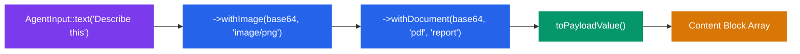
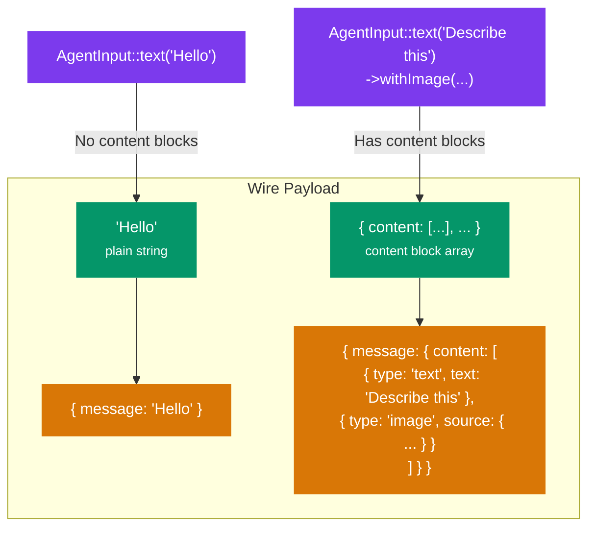

# Rich Input (AgentInput)

`AgentInput` is an immutable builder for sending multi-modal content to Strands agents. It supports text, images, documents (base64 and S3), videos (S3), structured output prompts, and interrupt responses.

## Table of Contents

- [Why AgentInput?](#why-agentinput)
- [API Reference](#api-reference)
  - [Factory Methods](#factory-methods)
  - [Builder Methods](#builder-methods)
  - [Serialization](#serialization)
- [Usage Examples](#usage-examples)
  - [Text Only](#text-only)
  - [Text with Image](#text-with-image)
  - [Text with Document](#text-with-document)
  - [Document from S3](#document-from-s3)
  - [Video from S3](#video-from-s3)
  - [Structured Output](#structured-output)
  - [Multiple Content Blocks](#multiple-content-blocks)
  - [Interrupt Response](#interrupt-response)
- [Wire Format](#wire-format)
- [Framework Integration](#framework-integration)
  - [Symfony](#symfony)
  - [Laravel](#laravel)

## Why AgentInput?

The standard `invoke()` and `stream()` methods accept a plain `string` message. This works for text-only conversations, but modern LLMs support multi-modal input: images, documents, videos. The Strands API represents these as **content blocks** within the message payload.

`AgentInput` provides a type-safe, immutable builder that serializes to the content block format the API expects. When no content blocks are attached, it serializes as a plain string for backward compatibility.



## API Reference

### Factory Methods

| Method | Description |
|--------|-------------|
| `AgentInput::text(string $text)` | Create an input starting with a text message. |
| `AgentInput::interruptResponse(string $interruptId, mixed $response)` | Create an interrupt response to resume after an interrupt. |

### Builder Methods

All builder methods return a **new instance** (clone-and-mutate pattern). The original is never modified.

| Method | Parameters | Description |
|--------|------------|-------------|
| `withImage()` | `string $base64Data, string $mediaType` | Add a base64-encoded image (e.g. `image/png`, `image/jpeg`). |
| `withDocument()` | `string $base64Data, string $format, string $name` | Add a base64-encoded document (e.g. `pdf`, `txt`, `docx`). |
| `withDocumentFromS3()` | `string $s3Uri, string $format, string $name, ?string $bucketOwner` | Add a document from an S3 location. |
| `withVideoFromS3()` | `string $s3Uri, string $format, ?string $bucketOwner` | Add a video from an S3 location. |
| `withStructuredOutputPrompt()` | `string $prompt` | Set a prompt to control the output format. |

### Serialization

| Method | Return Type | Description |
|--------|-------------|-------------|
| `getText()` | `string` | Get the text portion of this input. |
| `toPayloadValue()` | `string\|array` | Serialize to the wire format. Returns a plain string when no content blocks are attached. |

## Usage Examples

### Text Only

When no content blocks are attached, `AgentInput` is equivalent to passing a plain string:

```php
use StrandsPhpClient\Context\AgentInput;

// These two calls are equivalent on the wire:
$response = $client->invoke(message: 'Hello');
$response = $client->invoke(message: AgentInput::text('Hello'));
```

### Text with Image

```php
use StrandsPhpClient\Context\AgentInput;

$imageBytes = file_get_contents('photo.png');

$input = AgentInput::text("What's in this image?")
    ->withImage(base64_encode($imageBytes), 'image/png');

$response = $client->invoke(message: $input);
echo $response->text; // "The image shows a sunset over the ocean..."
```

### Text with Document

```php
use StrandsPhpClient\Context\AgentInput;

$pdfBytes = file_get_contents('report.pdf');

$input = AgentInput::text('Summarise the key findings in this report')
    ->withDocument(base64_encode($pdfBytes), 'pdf', 'Q4 Financial Report');

$response = $client->invoke(message: $input);
```

### Document from S3

For large files, avoid base64 encoding by pointing directly to S3:

```php
use StrandsPhpClient\Context\AgentInput;

$input = AgentInput::text('Summarise this report')
    ->withDocumentFromS3(
        s3Uri: 's3://my-bucket/reports/q4-2025.pdf',
        format: 'pdf',
        name: 'Q4 Report',
    );

$response = $client->invoke(message: $input);
```

With a cross-account bucket:

```php
$input = AgentInput::text('Analyse this document')
    ->withDocumentFromS3(
        s3Uri: 's3://partner-bucket/shared/analysis.pdf',
        format: 'pdf',
        name: 'Partner Analysis',
        bucketOwner: '123456789012',
    );
```

### Video from S3

```php
use StrandsPhpClient\Context\AgentInput;

$input = AgentInput::text('Describe what happens in this video')
    ->withVideoFromS3(
        s3Uri: 's3://my-bucket/videos/demo.mp4',
        format: 'mp4',
    );

$response = $client->invoke(message: $input);
```

### Structured Output

Use `withStructuredOutputPrompt()` to instruct the agent on output format:

```php
use StrandsPhpClient\Context\AgentInput;

$input = AgentInput::text('List the top 5 risks in this proposal')
    ->withStructuredOutputPrompt('Return a JSON array of objects with "risk" and "severity" keys');

$response = $client->invoke(message: $input);
// $response->structuredOutput may contain the parsed JSON if the agent supports it
```

### Multiple Content Blocks

Chain multiple content blocks together:

```php
use StrandsPhpClient\Context\AgentInput;

$input = AgentInput::text('Compare these two documents and the photo')
    ->withDocument(base64_encode($doc1), 'pdf', 'Contract v1')
    ->withDocument(base64_encode($doc2), 'pdf', 'Contract v2')
    ->withImage(base64_encode($photo), 'image/jpeg');

$response = $client->invoke(message: $input);
```

### Interrupt Response

When an agent returns an interrupt (human-in-the-loop), use `interruptResponse()` to resume:

```php
use StrandsPhpClient\Context\AgentInput;

// After receiving an interrupt from a previous invoke()...
$input = AgentInput::interruptResponse(
    interruptId: $interrupt->interruptId,
    response: ['approved' => true],
);

$response = $client->invoke(
    message: $input,
    sessionId: 'session-001', // Same session
);
```

See [interrupts-and-guardrails.md](interrupts-and-guardrails.md) for the full interrupt flow.

## Wire Format

`AgentInput` serializes differently depending on whether content blocks are attached:



**Text-only (no content blocks):**

```json
{
    "message": "Hello"
}
```

**With content blocks:**

```json
{
    "message": {
        "content": [
            { "type": "text", "text": "Describe this" },
            {
                "type": "image",
                "source": {
                    "type": "base64",
                    "media_type": "image/png",
                    "data": "iVBORw0KGgo..."
                }
            }
        ]
    }
}
```

**With structured output prompt:**

```json
{
    "message": {
        "content": [
            { "type": "text", "text": "List the risks" }
        ],
        "structured_output_prompt": "Return a JSON array"
    }
}
```

**Interrupt response:**

```json
{
    "message": {
        "content": [
            {
                "type": "interrupt_response",
                "interrupt_id": "int-abc-123",
                "response": { "approved": true }
            }
        ]
    }
}
```

## Framework Integration

`AgentInput` works with any `StrandsClient` instance, regardless of how it was created. Here are framework-specific examples showing it in context.

### Symfony

```php
use StrandsPhpClient\Context\AgentInput;
use StrandsPhpClient\StrandsClient;
use Symfony\Component\DependencyInjection\Attribute\Autowire;
use Symfony\Component\HttpFoundation\JsonResponse;
use Symfony\Component\HttpFoundation\Request;
use Symfony\Component\Routing\Attribute\Route;

class DocumentController extends AbstractController
{
    public function __construct(
        #[Autowire(service: 'strands.client.analyst')]
        private readonly StrandsClient $analyst,
    ) {}

    #[Route('/analyse-document', methods: ['POST'])]
    public function analyse(Request $request): JsonResponse
    {
        $file = $request->files->get('document');
        $question = $request->request->getString('question', 'Summarise this document');

        $input = AgentInput::text($question)
            ->withDocument(
                base64_encode(file_get_contents($file->getPathname())),
                $file->getClientOriginalExtension(),
                $file->getClientOriginalName(),
            );

        $response = $this->analyst->invoke(message: $input);

        return $this->json([
            'summary' => $response->text,
            'tokens' => $response->usage->totalTokens(),
        ]);
    }
}
```

### Laravel

```php
use StrandsPhpClient\Context\AgentInput;
use StrandsPhpClient\StrandsClient;
use Illuminate\Http\JsonResponse;
use Illuminate\Http\Request;

class DocumentController extends Controller
{
    public function __construct(
        private readonly StrandsClient $client,
    ) {}

    public function analyse(Request $request): JsonResponse
    {
        $file = $request->file('document');
        $question = $request->input('question', 'Summarise this document');

        $input = AgentInput::text($question)
            ->withDocument(
                base64_encode(file_get_contents($file->getPathname())),
                $file->getClientOriginalExtension(),
                $file->getClientOriginalName(),
            );

        $response = $this->client->invoke(message: $input);

        return response()->json([
            'summary' => $response->text,
            'tokens' => $response->usage->totalTokens(),
        ]);
    }
}
```
