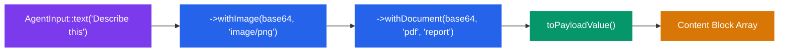
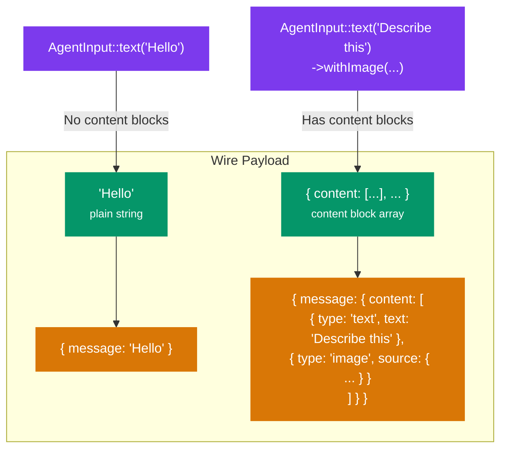

# Rich Input (AgentInput)

`AgentInput` is an immutable builder for multimodal content. It supports text, images, documents, videos, S3 and URL sources, cache points, document
context and citation controls, structured-output prompts, and interrupt responses.

## Table of Contents

- [Why AgentInput?](#why-agentinput)
- [API Reference](#api-reference)
  - [Factory Methods](#factory-methods)
  - [Builder Methods](#builder-methods)
  - [Serialization](#serialization)
- [Usage Examples](#usage-examples)
  - [Text Only](#text-only)
  - [Text with Image](#text-with-image)
  - [Text with Document](#text-with-document)
  - [Document from S3](#document-from-s3)
  - [Cache Point](#cache-point)
  - [Video from S3](#video-from-s3)
  - [Structured Output](#structured-output)
  - [Multiple Content Blocks](#multiple-content-blocks)
  - [Interrupt Response](#interrupt-response)
- [Wire Format](#wire-format)
- [Framework Integration](#framework-integration)
  - [Symfony](#symfony)
  - [Laravel](#laravel)

## Why AgentInput?

The standard `invoke()` and `stream()` methods accept a plain string for text-only conversations. Images, documents, and videos use **content blocks**
inside the Strands HTTP Wire Contract message.

`AgentInput` builds that payload without mutating a prior input. With no content blocks, it serializes to a backward-compatible plain string.


```mermaid
graph LR
    A["AgentInput::text('Describe this')"] --> B["->withImage(base64, 'image/png')"]
    B --> C["->withDocument(base64, 'pdf', 'report')"]
    C --> D["toPayloadValue()"]
    D --> E["Content Block Array"]

    style A fill:#7c3aed,color:#fff,stroke:none
    style B fill:#2563eb,color:#fff,stroke:none
    style C fill:#2563eb,color:#fff,stroke:none
    style D fill:#059669,color:#fff,stroke:none
    style E fill:#d97706,color:#fff,stroke:none
```

## API Reference

### Factory Methods

| Method | Description |
|--------|-------------|
| `AgentInput::text(string $text)` | Create an input starting with a text message. |
| `AgentInput::interruptResponse(string $interruptId, mixed $response)` | Create an interrupt response to resume after an interrupt. |

### Builder Methods

All builder methods return a **new instance** (clone-and-mutate pattern). The original is never modified.

| Method | Parameters | Description |
|--------|------------|-------------|
| `withImage()` | `string $base64Data, string $mediaType` | Add a base64-encoded image (e.g. `image/png`, `image/jpeg`). |
| `withImageFromS3()` | `string $s3Uri, string $format, ?string $bucketOwner` | Add an image from an S3 location. |
| `withImageFromUrl()` | `string $url, string $mediaType` | Add a wrapper-supported URL image source. |
| `withDocument()` | `string $base64Data, string $format, string $name` | Add a base64-encoded document with the unchanged 1.x signature. |
| `withDocumentOptions()` | `string $base64Data, string $format, string $name, ?string $context, ?array $citations` | Add a base64-encoded document with wrapper context/citation controls. |
| `withDocumentFromS3()` | `string $s3Uri, string $format, string $name, ?string $bucketOwner` | Add an S3 document with the unchanged 1.x signature. |
| `withDocumentFromS3Options()` | `string $s3Uri, string $format, string $name, ?string $bucketOwner, ?string $context, ?array $citations` | Add an S3 document with wrapper context/citation controls. |
| `withDocumentFromUrl()` | `string $url, string $format, string $name, ?string $context, ?array $citations` | Add a wrapper-supported URL document source. |
| `withVideo()` | `string $base64Data, string $format` | Add a base64-encoded video. |
| `withVideoFromS3()` | `string $s3Uri, string $format, ?string $bucketOwner` | Add a video from an S3 location. |
| `withVideoFromUrl()` | `string $url, string $format` | Add a wrapper-supported URL video source. |
| `withCachePoint()` | `string $type = 'default', ?string $ttl = null` | Add a wrapper cache point block. |
| `withStructuredOutputPrompt()` | `string $prompt` | Set a prompt to control the output format. |

### Serialization

| Method | Return Type | Description |
|--------|-------------|-------------|
| `getText()` | `string` | Get the text portion of this input. |
| `toPayloadValue()` | `string\|array` | Serialize to the wire format. Returns a plain string when no content blocks are attached. |

## Usage Examples

### Text Only

When no content blocks are attached, `AgentInput` is equivalent to passing a plain string:

```php
use StrandsPhpClient\Context\AgentInput;

// These two calls are equivalent on the wire:
$response = $client->invoke(message: 'Hello');
$response = $client->invoke(message: AgentInput::text('Hello'));
```

### Text with Image

```php
use StrandsPhpClient\Context\AgentInput;

$imageBytes = file_get_contents('photo.png');

$input = AgentInput::text("What's in this image?")
    ->withImage(base64_encode($imageBytes), 'image/png');

$response = $client->invoke(message: $input);
echo $response->text; // "The image shows a sunset over the ocean..."
```

### Text with Document

```php
use StrandsPhpClient\Context\AgentInput;

$pdfBytes = file_get_contents('report.pdf');

$input = AgentInput::text('Summarise the key findings in this report')
    ->withDocumentOptions(
        base64_encode($pdfBytes),
        'pdf',
        'Q4 Financial Report',
        context: 'Quarterly report uploaded for board review.',
        citations: ['enabled' => true],
    );

$response = $client->invoke(message: $input);
```

### Cache Point

Cache points are wrapper-owned content blocks that the Python gateway can translate into sdk-python or provider cache controls:

```php
use StrandsPhpClient\Context\AgentInput;

$input = AgentInput::text('Use the stable policy context, then answer the question.')
    ->withCachePoint(ttl: '5m')
    ->withDocumentFromS3('s3://my-bucket/policy.pdf', 'pdf', 'Policy');

$response = $client->invoke(message: $input);
```

### Document from S3

For large files, avoid base64 encoding by pointing directly to S3:

```php
use StrandsPhpClient\Context\AgentInput;

$input = AgentInput::text('Summarise this report')
    ->withDocumentFromS3(
        s3Uri: 's3://my-bucket/reports/q4-2025.pdf',
        format: 'pdf',
        name: 'Q4 Report',
    );

$response = $client->invoke(message: $input);
```

With a cross-account bucket:

```php
$input = AgentInput::text('Analyse this document')
    ->withDocumentFromS3(
        s3Uri: 's3://partner-bucket/shared/analysis.pdf',
        format: 'pdf',
        name: 'Partner Analysis',
        bucketOwner: '123456789012',
    );
```

### Video from S3

```php
use StrandsPhpClient\Context\AgentInput;

$input = AgentInput::text('Describe what happens in this video')
    ->withVideoFromS3(
        s3Uri: 's3://my-bucket/videos/demo.mp4',
        format: 'mp4',
    );

$response = $client->invoke(message: $input);
```

### Structured Output

Use `withStructuredOutputPrompt()` to instruct the agent on output format:

```php
use StrandsPhpClient\Context\AgentInput;

$input = AgentInput::text('List the top 5 risks in this proposal')
    ->withStructuredOutputPrompt('Return a JSON array of objects with "risk" and "severity" keys');

$response = $client->invoke(message: $input);
// $response->structuredOutput may contain the parsed JSON if the agent supports it
```

### Multiple Content Blocks

Chain multiple content blocks together:

```php
use StrandsPhpClient\Context\AgentInput;

$input = AgentInput::text('Compare these two documents and the photo')
    ->withDocument(base64_encode($doc1), 'pdf', 'Contract v1')
    ->withDocument(base64_encode($doc2), 'pdf', 'Contract v2')
    ->withImage(base64_encode($photo), 'image/jpeg');

$response = $client->invoke(message: $input);
```

### Interrupt Response

When an agent pauses for human input, build the resume payload from its `InterruptDetail`. This preserves the interrupt ID and falls back to the
tool-use ID when the wrapper supplied no separate interrupt ID:

```php
// The user approved an interrupt returned by an earlier invoke() call.
$resumeInput = $interrupt->toResumeInput(['approved' => true]);

$response = $client->invoke(
    message: $resumeInput,
    sessionId: 'session-001', // Same session
);
```

See [interrupts-and-guardrails.md](interrupts-and-guardrails.md) for the full interrupt flow.

## Wire Format

`AgentInput` serializes differently depending on whether content blocks are attached:

This is the PHP-facing Strands HTTP Wire Contract shape. A Python wrapper translates it into sdk-python or provider content blocks. URL sources are
wrapper extensions and require explicit server support.


```mermaid
graph TD
    A["AgentInput::text('Hello')"] -->|No content blocks| B["'Hello'<br/><small>plain string</small>"]
    A2["AgentInput::text('Describe this')<br/>->withImage(...)"] -->|Has content blocks| C["{ content: [...], ... }<br/><small>content block array</small>"]

    subgraph "Wire Payload"
        B --> D["{ message: 'Hello' }"]
        C --> E["{ message: { content: [\n  { type: 'text', text: 'Describe this' },\n  { type: 'image', source: { ... } }\n] } }"]
    end

    style A fill:#7c3aed,color:#fff,stroke:none
    style A2 fill:#7c3aed,color:#fff,stroke:none
    style B fill:#059669,color:#fff,stroke:none
    style C fill:#059669,color:#fff,stroke:none
    style D fill:#d97706,color:#fff,stroke:none
    style E fill:#d97706,color:#fff,stroke:none
```

**Text-only (no content blocks):**

```json
{
    "message": "Hello"
}
```

**With content blocks:**

```json
{
    "message": {
        "content": [
            { "type": "text", "text": "Describe this" },
            {
                "type": "image",
                "format": "png",
                "source": {
                    "type": "base64",
                    "media_type": "image/png",
                    "data": "iVBORw0KGgo..."
                }
            }
        ]
    }
}
```

**Document context and citations:**

```json
{
    "message": {
        "content": [
            { "type": "text", "text": "Summarise this referral" },
            {
                "type": "document",
                "name": "referral.pdf",
                "format": "pdf",
                "context": "Referral uploaded for clinical summarisation.",
                "citations": { "enabled": true },
                "source": {
                    "type": "s3_location",
                    "uri": "s3://bucket/referral.pdf"
                }
            }
        ]
    }
}
```

**Cache point:**

```json
{
    "message": {
        "content": [
            { "type": "text", "text": "Use cached context" },
            { "type": "cache_point", "cache_type": "default", "ttl": "5m" }
        ]
    }
}
```

**With structured output prompt:**

```json
{
    "message": {
        "content": [
            { "type": "text", "text": "List the risks" }
        ],
        "structured_output_prompt": "Return a JSON array"
    }
}
```

**Interrupt response:**

```json
{
    "message": {
        "content": [
            {
                "type": "interrupt_response",
                "interrupt_id": "int-abc-123",
                "response": { "approved": true }
            }
        ]
    }
}
```

## Framework Integration

`AgentInput` works with any `StrandsClient`, regardless of how the application created it. The following controllers validate file presence, type, and
size before reading an upload; adjust the allowlist and limit for the agent service you operate. They use an app-owned document name instead of
forwarding the untrusted browser filename.

### Symfony

```php
use Symfony\Bundle\FrameworkBundle\Controller\AbstractController;
use Symfony\Component\DependencyInjection\Attribute\Autowire;
use Symfony\Component\HttpFoundation\File\UploadedFile;
use Symfony\Component\HttpFoundation\JsonResponse;
use Symfony\Component\HttpFoundation\Request;
use Symfony\Component\Routing\Attribute\Route;

use StrandsPhpClient\Context\AgentInput;
use StrandsPhpClient\StrandsClient;

/**
 * Accepts a small supported document and returns the agent's summary.
 *
 * Use this controller for an upload screen after applying the application's normal authorization and CSRF controls.
 * Its JSON response supplies either actionable upload feedback or the summary shown on that screen.
 */
final class DocumentController extends AbstractController
{
    /**
     * Inject the named agent that handles document-analysis requests.
     *
     * @param StrandsClient $analystClient Configured agent for this upload screen; never null.
     */
    public function __construct(
        #[Autowire(service: 'strands.client.analyst')]
        private readonly StrandsClient $analystClient,
    ) {
    }

    /**
     * Validate the upload and return a summary the document screen can render.
     *
     * @param Request $request Form submission; a missing file or blank question receives useful UI feedback or a default prompt.
     * @return JsonResponse Summary on success, or a non-empty validation error with HTTP 422.
     */
    #[Route('/analyse-document', methods: ['POST'])]
    public function analyseDocument(Request $request): JsonResponse
    {
        $uploadedDocument = $request->files->get('document');
        $submittedQuestion = trim($request->request->getString('question'));

        // A blank question uses a useful default instead of asking the agent to interpret an empty prompt.
        $summaryQuestion = $submittedQuestion !== '' ? $submittedQuestion : 'Summarise this document';

        // A missing or failed upload gives the user a validation response instead of a server error.
        if (!$uploadedDocument instanceof UploadedFile || !$uploadedDocument->isValid()) {
            return $this->json(['error' => 'Choose a valid document to analyse.'], 422);
        }

        // An unrecognized MIME type maps to null so the validation response can explain the supported formats.
        $documentFormat = match ($uploadedDocument->getMimeType()) {
            'application/pdf' => 'pdf',
            'text/plain' => 'txt',
            'application/vnd.openxmlformats-officedocument.wordprocessingml.document' => 'docx',
            default => null,
        };

        $documentSizeBytes = $uploadedDocument->getSize();

        // Unsupported, unreadable-size, or oversized files are rejected before their bytes leave the PHP application.
        if ($documentFormat === null || !is_int($documentSizeBytes) || $documentSizeBytes > 10 * 1024 * 1024) {
            return $this->json(['error' => 'Upload a PDF, TXT, or DOCX file no larger than 10 MB.'], 422);
        }

        $documentBytes = file_get_contents($uploadedDocument->getPathname());
        // A transient filesystem failure means there is no safe document payload to send to the agent.
        if ($documentBytes === false) {
            return $this->json(['error' => 'The uploaded document could not be read.'], 422);
        }

        $documentInput = AgentInput::text($summaryQuestion)
            ->withDocument(
                base64_encode($documentBytes),
                $documentFormat,
                'uploaded-document',
            );

        $summaryResponse = $this->analystClient->invoke(message: $documentInput);

        return $this->json([
            'summary' => $summaryResponse->text,
            'tokens' => $summaryResponse->usage->totalTokens(),
        ]);
    }
}
```

### Laravel

```php
use Illuminate\Http\JsonResponse;
use Illuminate\Http\Request;
use Illuminate\Http\UploadedFile;

use StrandsPhpClient\Context\AgentInput;
use StrandsPhpClient\StrandsClient;

/**
 * Accepts a small supported document and returns the agent's summary.
 *
 * Use this controller for an upload screen after applying the application's normal authorization and CSRF controls.
 * Its JSON response supplies either actionable upload feedback or the summary shown on that screen.
 */
final class DocumentController extends Controller
{
    /**
     * Inject the default agent used by the document-analysis screen.
     *
     * @param StrandsClient $documentAgentClient Configured agent for this upload screen; never null.
     */
    public function __construct(
        private readonly StrandsClient $documentAgentClient,
    ) {
    }

    /**
     * Validate the upload and return a summary the document screen can render.
     *
     * @param Request $request Form submission; a missing file or blank question receives useful UI feedback or a default prompt.
     * @return JsonResponse Summary on success; Laravel converts invalid input into a non-empty validation response.
     */
    public function analyseDocument(Request $request): JsonResponse
    {
        $validatedInput = $request->validate([
            'document' => ['required', 'file', 'mimes:pdf,txt,docx', 'max:10240'],
            'question' => ['nullable', 'string', 'max:2000'],
        ]);
        /** @var UploadedFile $uploadedDocument The required file Laravel accepted for this request. */
        $uploadedDocument = $request->file('document');

        // A missing or non-string question becomes blank before the default prompt is selected.
        $submittedQuestion = is_string($validatedInput['question'] ?? null) ? trim($validatedInput['question']) : '';
        // A blank question uses a useful default instead of asking the agent to interpret an empty prompt.
        $summaryQuestion = $submittedQuestion !== '' ? $submittedQuestion : 'Summarise this document';

        // An unrecognized MIME type maps to null so the validation response can explain the supported formats.
        $documentFormat = match ($uploadedDocument->getMimeType()) {
            'application/pdf' => 'pdf',
            'text/plain' => 'txt',
            'application/vnd.openxmlformats-officedocument.wordprocessingml.document' => 'docx',
            default => null,
        };

        // A MIME result outside the validated allowlist cannot become a trusted AgentInput document format.
        if ($documentFormat === null) {
            abort(422, 'Upload a PDF, TXT, or DOCX file.');
        }

        $documentBytes = file_get_contents($uploadedDocument->getPathname());
        // A transient filesystem failure means there is no safe document payload to send to the agent.
        if ($documentBytes === false) {
            abort(422, 'The uploaded document could not be read.');
        }

        $documentInput = AgentInput::text($summaryQuestion)
            ->withDocument(
                base64_encode($documentBytes),
                $documentFormat,
                'uploaded-document',
            );

        $summaryResponse = $this->documentAgentClient->invoke(message: $documentInput);

        return response()->json([
            'summary' => $summaryResponse->text,
            'tokens' => $summaryResponse->usage->totalTokens(),
        ]);
    }
}
```
