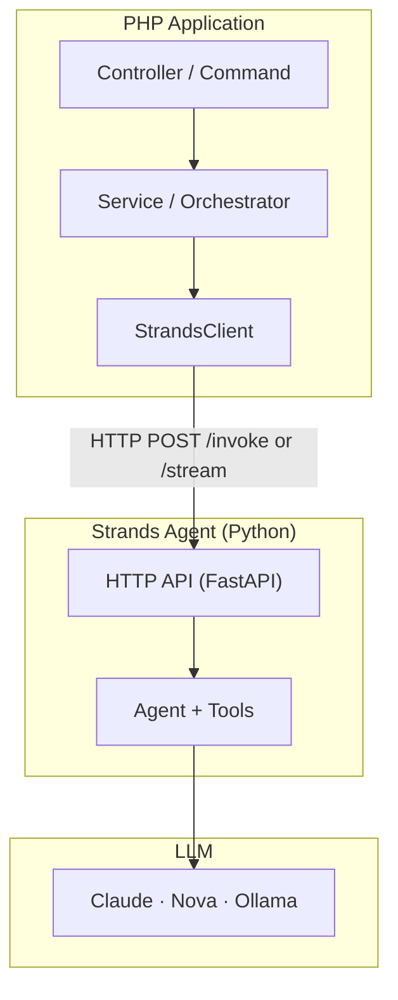

# Usage Guide

This guide walks through real-world usage patterns for the Strands PHP Client, based on the [the-summit-chat](https://github.com/blundergoat/the-summit-chat) demo application — a Symfony app where three AI agents (Analyst, Skeptic, Strategist) debate your decisions.

## Table of Contents

- [Architecture Overview](#architecture-overview)
- [Basic Invoke](#basic-invoke)
- [Streaming with SSE](#streaming-with-sse)
- [Session Management](#session-management)
- [Context Builder](#context-builder)
- [Authentication](#authentication)
- [Retries and Timeouts](#retries-and-timeouts)
- [Logging](#logging)
- [Symfony Integration](#symfony-integration)
- [Multi-Agent Orchestration](#multi-agent-orchestration)
- [Streaming to the Browser with Mercure](#streaming-to-the-browser-with-mercure)
- [Building Your Python Agent](#building-your-python-agent)
- [Testing](#testing)

## Architecture Overview

A typical Strands application follows this pattern:



The PHP side never runs an agentic loop. It sends a message, optionally with context and a session ID, and gets back a response or a stream of events. All reasoning, tool calling, and state management happens in the Python agent.

## Basic Invoke

The simplest usage — send a message, get a response:

```php
use Strands\StrandsClient;
use Strands\Config\StrandsConfig;

$client = new StrandsClient(
    config: new StrandsConfig(endpoint: 'http://localhost:8081'),
);

$response = $client->invoke(message: 'Should we migrate to microservices?');

echo $response->text;                    // Agent's full response
echo $response->agent;                   // Which agent handled it (e.g. "analyst")
echo $response->sessionId;               // Session ID for follow-ups
echo $response->usage->inputTokens;      // Tokens consumed
echo $response->usage->outputTokens;     // Tokens generated
print_r($response->toolsUsed);           // Tools the agent called
```

`invoke()` blocks until the agent finishes its entire reasoning loop (including any tool calls) and returns the final response.

## Streaming with SSE

For real-time token delivery, use `stream()`. Each event arrives as the agent produces it, and `stream()` returns a `StreamResult` with the accumulated text and metadata:

```php
use Strands\Streaming\StreamEvent;
use Strands\Streaming\StreamEventType;

$result = $client->stream(
    message: 'Explain quantum computing',
    onEvent: function (StreamEvent $event) {
        match ($event->type) {
            StreamEventType::Text       => print($event->text),
            StreamEventType::ToolUse    => print("[Using tool: {$event->toolName}]"),
            StreamEventType::ToolResult => print("[Tool result: {$event->toolName}]"),
            StreamEventType::Thinking   => print("[Thinking...]"),
            StreamEventType::Complete   => print("\n[Done]"),
            StreamEventType::Error      => print("Error: {$event->errorMessage}"),
        };
    },
    sessionId: 'session-001',
);

// StreamResult has the accumulated data from the entire stream
echo $result->text;                   // Full text assembled from all Text events
echo $result->sessionId;              // Session ID from the Complete event
echo $result->usage->inputTokens;     // Token usage
echo $result->usage->outputTokens;
echo $result->textEvents;             // Number of Text events received
echo $result->totalEvents;            // Total events (text + tools + complete)
```

**Event types:**

| Type | Description | Key Fields |
|------|-------------|------------|
| `Text` | Content token | `$event->text` |
| `ToolUse` | Agent is calling a tool | `$event->toolName`, `$event->toolInput` |
| `ToolResult` | Tool returned a result | `$event->toolName`, `$event->toolResult` |
| `Thinking` | Agent is reasoning | `$event->text` |
| `Complete` | Stream finished | `$event->fullText`, `$event->sessionId`, `$event->usage` |
| `Error` | Error occurred | `$event->errorCode`, `$event->errorMessage` |

`Complete` and `Error` are terminal events. If the stream ends without one, the client throws `StreamInterruptedException`.

> **Note:** Streaming requires `symfony/http-client` via `SymfonyHttpTransport`. PSR-18 clients only support `invoke()`.

## Session Management

Sessions enable multi-turn conversations. The client sends a `session_id` — the Python agent manages all state server-side.

```php
// First turn
$r1 = $client->invoke(
    message: 'Draft a referral letter for a patient',
    sessionId: 'consult-001',
);

// Second turn — agent remembers the full conversation
$r2 = $client->invoke(
    message: 'Make it more formal and add the diagnosis',
    sessionId: 'consult-001',
);
```

**How the-summit-chat handles sessions:**

The browser generates a UUID per tab and sends it with every request:

```javascript
// Browser-side session management
let sessionId = sessionStorage.getItem('summit_session_id');
if (!sessionId) {
    sessionId = crypto.randomUUID();
    sessionStorage.setItem('summit_session_id', sessionId);
}

// Sent with every request
fetch('/chat', {
    method: 'POST',
    body: JSON.stringify({
        message: message,
        session_id: sessionId,
    }),
});
```

The controller passes it through to the client:

```php
$sessionId = is_string($data['session_id'] ?? null) ? $data['session_id'] : null;

$response = $client->invoke(
    message: $message,
    sessionId: $sessionId,
);
```

**Session sharing across agents:** In the-summit-chat, all three agents receive the same `session_id`. The Skeptic sees what the Analyst said, and the Strategist sees both. This is how multi-agent debate works — shared session history.

## Context Builder

`AgentContext` is an immutable builder for passing application context to agents. It uses a clone-and-mutate pattern — every `with*()` call returns a new instance.

```php
use Strands\Context\AgentContext;

$context = AgentContext::create()
    ->withMetadata('persona', 'analyst')
    ->withMetadata('user_role', 'practitioner')
    ->withSystemPrompt('You are a clinical documentation assistant.')
    ->withPermission('read:patients')
    ->withPermission('write:notes')
    ->withDocument('referral.pdf', base64_encode($pdfBytes), 'application/pdf')
    ->withStructuredData('patient', [
        'id' => 'P-123',
        'name' => 'Jane Doe',
        'age' => 42,
    ]);

$response = $client->invoke(
    message: 'Summarise this referral',
    context: $context,
    sessionId: 'consult-001',
);
```

**What the-summit-chat passes as context:**

Each agent gets a `persona` metadata field that tells the Python agent which system prompt to use:

```php
$context = AgentContext::create()->withMetadata('persona', $persona);

$response = $client->invoke(
    message: $message,
    context: $context,
    sessionId: $sessionId,
);
```

Instead of three separate endpoints, one endpoint with metadata selects the persona. The Python agent reads `context.metadata.persona` and applies the matching system prompt (Analyst, Skeptic, or Strategist).

## Authentication

The client supports pluggable authentication strategies. See [docs/auth.md](auth.md) for the full guide.

**No auth (local dev — the default):**

```php
$config = new StrandsConfig(endpoint: 'http://localhost:8081');
```

**API key auth (production):**

```php
use Strands\Auth\ApiKeyAuth;

$config = new StrandsConfig(
    endpoint: 'https://api.example.com/agent',
    auth: new ApiKeyAuth('sk-your-api-key'),
);
```

**Custom header:**

```php
$config = new StrandsConfig(
    endpoint: 'https://api.example.com/agent',
    auth: new ApiKeyAuth('sk-key', headerName: 'X-API-Key', valuePrefix: ''),
);
```

## Retries and Timeouts

For production reliability, configure retries with exponential backoff:

```php
$config = new StrandsConfig(
    endpoint: 'https://api.example.com/agent',
    timeout: 120,           // Response timeout in seconds (default: 120)
    connectTimeout: 5,      // TCP connection timeout (default: 10)
    maxRetries: 3,          // Retry up to 3 times on 429/502/503/504
    retryDelayMs: 500,      // Base delay: 500ms → 1000ms → 2000ms
);
```

The `connectTimeout` is separate from `timeout` so a down server fails fast (5 seconds) without affecting slow LLM generation (which can legitimately take 120+ seconds).

Retries apply to `invoke()` calls only. Streaming requests are not retried.

## Logging

`StrandsClient` accepts an optional PSR-3 logger. It logs:
- `debug` — Request URLs, response metadata (session ID, token usage, event counts)
- `warning` — Retry attempts with delay and error details

```php
use Psr\Log\LoggerInterface;

// Vanilla PHP — pass any PSR-3 logger
$client = new StrandsClient(
    config: $config,
    logger: $yourMonologLogger,
);

// Symfony — injected automatically via the bundle
// All StrandsClient instances get the app's logger for free
```

## Symfony Integration

The Symfony bundle registers named `StrandsClient` services from YAML config. This is the recommended setup for Symfony projects. See [docs/symfony-config.md](symfony-config.md) for the full configuration reference.

### Configuration

```yaml
# config/packages/strands.yaml
strands:
    agents:
        analyst:
            endpoint: '%env(AGENT_ENDPOINT)%'
            timeout: 300
        skeptic:
            endpoint: '%env(AGENT_ENDPOINT)%'
            timeout: 300
            auth:
                driver: api_key
                api_key: '%env(AGENT_API_KEY)%'
        strategist:
            endpoint: '%env(AGENT_ENDPOINT)%'
            timeout: 300
            max_retries: 2
```

Each agent entry creates a service named `strands.client.<name>`.

### Injection with #[Autowire]

Inject named clients into your services using Symfony's `#[Autowire]` attribute:

```php
use Strands\StrandsClient;
use Symfony\Component\DependencyInjection\Attribute\Autowire;

class SummitCouncilOrchestrator
{
    public function __construct(
        #[Autowire(service: 'strands.client.analyst')]
        private readonly StrandsClient $analyst,

        #[Autowire(service: 'strands.client.skeptic')]
        private readonly StrandsClient $skeptic,

        #[Autowire(service: 'strands.client.strategist')]
        private readonly StrandsClient $strategist,
    ) {
    }
}
```

The bundle auto-detects `symfony/http-client` and creates `SymfonyHttpTransport` instances — both `invoke()` and `stream()` work out of the box. A PSR-3 logger is injected automatically.

### Bundle registration

```php
// config/bundles.php
return [
    Symfony\Bundle\FrameworkBundle\FrameworkBundle::class => ['all' => true],
    Strands\Integration\Symfony\StrandsBundle::class => ['all' => true],
    // ...
];
```

## Multi-Agent Orchestration

the-summit-chat demonstrates a **council pattern** — multiple agents called sequentially with a shared session, each building on the previous responses.

### Synchronous orchestration

All three agents are called in sequence. Each sees what prior agents said via the shared session:

```php
class SummitCouncilOrchestrator
{
    public function deliberate(string $message, ?string $sessionId): array
    {
        $clients = [
            'analyst'    => $this->analyst,
            'skeptic'    => $this->skeptic,
            'strategist' => $this->strategist,
        ];

        $responses = [];

        foreach ($clients as $persona => $client) {
            $context = AgentContext::create()->withMetadata('persona', $persona);

            $response = $client->invoke(
                message: $message,
                context: $context,
                sessionId: $sessionId,
            );

            $responses[] = [
                'persona' => $persona,
                'text' => $response->text,
            ];
        }

        return $responses;
    }
}
```

**How the council debate works:**

1. **Analyst** goes first — analyses the question with no prior context
2. **Skeptic** goes second — the shared session contains the Analyst's response, so the Skeptic can challenge it
3. **Strategist** goes third — sees both the Analyst and Skeptic's arguments and synthesises a recommendation

### Controller wiring

```php
#[Route('/chat', name: 'chat_submit', methods: ['POST'])]
public function submit(Request $request): JsonResponse
{
    $data = json_decode($request->getContent(), true);
    $message = is_string($data['message'] ?? null) ? $data['message'] : '';
    $sessionId = is_string($data['session_id'] ?? null) ? $data['session_id'] : null;

    $responses = $this->orchestrator->deliberate($message, $sessionId);

    return $this->json([
        'responses' => $responses,
        'session_id' => $sessionId,
    ]);
}
```

## Streaming to the Browser with Mercure

the-summit-chat uses [Mercure](https://mercure.rocks/) to push stream events from the PHP backend to the browser in real-time. This is a pattern for any app that needs to show tokens as they arrive.

### The streaming orchestrator

```php
class SummitCouncilStreamOrchestrator
{
    public function __construct(
        #[Autowire(service: 'strands.client.analyst')]
        private readonly StrandsClient $analyst,
        // ... skeptic, strategist
        private readonly HubInterface $hub,
    ) {
    }

    public function deliberateStreaming(
        string $message,
        string $sessionId,
        string $topicBase,
    ): void {
        $clients = [
            'analyst'    => $this->analyst,
            'skeptic'    => $this->skeptic,
            'strategist' => $this->strategist,
        ];

        foreach ($clients as $persona => $client) {
            $topic = "{$topicBase}/{$persona}";
            $context = AgentContext::create()->withMetadata('persona', $persona);

            $client->stream(
                message: $message,
                onEvent: function (StreamEvent $event) use ($topic, $persona) {
                    match ($event->type) {
                        StreamEventType::Text => $this->publish($topic, [
                            'type' => 'text',
                            'persona' => $persona,
                            'content' => $event->text,
                        ]),
                        StreamEventType::ToolUse => $this->publish($topic, [
                            'type' => 'tool_use',
                            'persona' => $persona,
                            'tool_name' => $event->toolName,
                        ]),
                        StreamEventType::Complete => $this->publish($topic, [
                            'type' => 'complete',
                            'persona' => $persona,
                        ]),
                        StreamEventType::Error => $this->publish($topic, [
                            'type' => 'error',
                            'persona' => $persona,
                            'message' => $event->errorMessage,
                        ]),
                        default => null,
                    };
                },
                context: $context,
                sessionId: $sessionId,
            );
        }
    }
}
```

### Deferring streaming to kernel.terminate

The controller returns a response immediately, then starts streaming after the response is sent. This gives the browser time to subscribe to Mercure topics before tokens start arriving:

```php
if ($streaming && $this->streamOrchestrator !== null) {
    $topicBase = 'summit-council/' . ($sessionId ?? 'anonymous');

    // Schedule streaming AFTER the HTTP response is sent
    $this->eventDispatcher->addListener(
        'kernel.terminate',
        static function () use ($orchestrator, $message, $sessionId, $topicBase): void {
            $orchestrator->deliberateStreaming($message, $sessionId, $topicBase);
        },
    );

    return $this->json([
        'status' => 'streaming',
        'session_id' => $sessionId,
        'topic' => $topicBase,
    ]);
}
```

### Browser-side: subscribing to the stream

```javascript
const eventSource = new EventSource(`${mercureUrl}?topic=${topicBase}/analyst&topic=${topicBase}/skeptic&topic=${topicBase}/strategist`);

eventSource.onmessage = (event) => {
    const data = JSON.parse(event.data);

    switch (data.type) {
        case 'text':
            appendToken(data.persona, data.content);
            break;
        case 'complete':
            markAgentDone(data.persona);
            break;
        case 'error':
            showError(data.persona, data.message);
            break;
    }
};
```

## Building Your Python Agent

The PHP client sends HTTP requests to your Python agent and expects specific JSON and SSE response formats. This section covers the contract, common pitfalls, and a minimal working example.

### JSON payload the PHP client sends

When you call `$client->invoke()` or `$client->stream()`, the PHP client sends a POST request with this JSON body:

```json
{
    "message": "Should we migrate to microservices?",
    "session_id": "550e8400-e29b-41d4-a716-446655440000",
    "context": {
        "metadata": {
            "persona": "analyst",
            "user_role": "practitioner"
        }
    }
}
```

- `message` (string, required) — The user's message.
- `session_id` (string, optional) — UUID for multi-turn conversation continuity. Omitted for one-shot requests.
- `context` (object, optional) — Application context from `AgentContext`. Only non-empty fields are included (`system_prompt`, `metadata`, `permissions`, `documents`, `structured_data`). Null/empty values are omitted entirely.

### SSE event contract (streaming)

For `/stream`, the PHP client's `StreamParser` expects Server-Sent Events with `data:` lines containing JSON. Each event must have a `type` field:

| Type | Required Fields | Description |
|------|----------------|-------------|
| `text` | `content` | A piece of generated text (token) |
| `thinking` | — | Agent is reasoning (informational) |
| `tool_use` | `tool_name` | Agent is calling a tool |
| `tool_result` | `tool_name` | Tool returned a result |
| `complete` | `text` | Stream finished — includes full response text |
| `error` | `message` | Stream failed — includes error description |

Every stream **must** end with either `complete` or `error`. If the connection drops without a terminal event, the PHP client throws `StreamInterruptedException`.

Example SSE output:

```
data: {"type": "text", "content": "The"}

data: {"type": "text", "content": " answer"}

data: {"type": "text", "content": " is 42."}

data: {"type": "complete", "text": "The answer is 42.", "session_id": "abc-123", "usage": {}, "tools_used": []}

```

### Calling the Strands SDK correctly

> **This is the most common pitfall.** Getting this wrong produces generic responses that ignore the user's question entirely.

The Strands SDK `Agent` class accepts conversation input as the **first positional argument** (`prompt`), which supports multiple formats:

```python
# String — single-turn conversation
result = agent("Should we migrate to microservices?")

# Messages list — multi-turn conversation with history
result = agent(messages)

# Async streaming
async for event in agent.stream_async(messages):
    ...
```

**Common mistake — passing messages as a keyword argument:**

```python
# WRONG — "messages" goes into **kwargs, NOT the prompt parameter.
# The agent runs with NO conversation history and only sees its system prompt.
result = agent(messages=messages)
async for event in agent.stream_async(messages=messages):  # Also wrong
```

This is wrong because the SDK signature is:

```python
def __call__(self, prompt=None, *, invocation_state=None, **kwargs):
```

Passing `messages=messages` sends it into `**kwargs` (deprecated), not `prompt`. The agent never sees the user's question and generates a generic response based on the system prompt alone.

### Message content format

The Strands SDK expects message content as a **list of content blocks**, not a plain string:

```python
# WRONG — the SDK will iterate over characters, not words
messages = [{"role": "user", "content": "Hello world"}]

# CORRECT — content is a list of ContentBlock dicts
messages = [{"role": "user", "content": [{"text": "Hello world"}]}]
```

If your session store uses plain strings internally (which is simpler), convert before passing to the SDK:

```python
def to_sdk_messages(messages: list[dict]) -> list[dict]:
    """Convert plain-text messages to Strands SDK format."""
    sdk_messages = []
    for msg in messages:
        content = msg["content"]
        if isinstance(content, str):
            content = [{"text": content}]
        sdk_messages.append({"role": msg["role"], "content": content})
    return sdk_messages
```

### Minimal working FastAPI agent

Here's a complete, minimal Python agent that works with the PHP client:

```python
import json
from fastapi import FastAPI
from fastapi.responses import StreamingResponse
from pydantic import BaseModel, Field
from strands import Agent
from strands.models.ollama import OllamaModel

app = FastAPI()

model = OllamaModel(host="http://localhost:11434", model_id="qwen2.5:7b")


class RequestContext(BaseModel):
    system_prompt: str | None = None
    metadata: dict = Field(default_factory=dict)


class AgentRequest(BaseModel):
    message: str
    session_id: str | None = None
    context: RequestContext = Field(default_factory=RequestContext)


def to_sdk_messages(message: str) -> list[dict]:
    """Convert a plain text message to Strands SDK message format."""
    return [{"role": "user", "content": [{"text": message}]}]


@app.post("/invoke")
async def invoke(req: AgentRequest):
    system_prompt = req.context.system_prompt or "You are a helpful assistant."
    agent = Agent(model=model, system_prompt=system_prompt, tools=[])

    # Pass messages as the FIRST POSITIONAL argument
    messages = to_sdk_messages(req.message)
    result = agent(messages)

    return {
        "text": str(result),
        "agent": req.context.metadata.get("persona", "default"),
        "session_id": req.session_id,
        "usage": {},
        "tools_used": [],
    }


@app.post("/stream")
async def stream(req: AgentRequest):
    system_prompt = req.context.system_prompt or "You are a helpful assistant."
    agent = Agent(model=model, system_prompt=system_prompt, tools=[])
    messages = to_sdk_messages(req.message)

    async def generate():
        full_text = ""
        got_terminal = False

        try:
            # Pass messages as the FIRST POSITIONAL argument — not messages=messages
            async for event in agent.stream_async(messages):
                if isinstance(event, dict):
                    event_type = event.get("type", "")
                    if event_type == "text":
                        full_text += event.get("content", "")
                        yield f"data: {json.dumps(event)}\n\n"
                    elif event_type in ("complete", "error"):
                        got_terminal = True
                        yield f"data: {json.dumps(event)}\n\n"
                elif isinstance(event, str):
                    full_text += event
                    yield f'data: {json.dumps({"type": "text", "content": event})}\n\n'

            if not got_terminal:
                yield f'data: {json.dumps({"type": "complete", "text": full_text, "session_id": req.session_id, "usage": {}, "tools_used": []})}\n\n'
        except Exception as e:
            if not got_terminal:
                yield f'data: {json.dumps({"type": "error", "message": str(e)})}\n\n'

    return StreamingResponse(generate(), media_type="text/event-stream")


@app.get("/health")
async def health():
    return {"status": "ok"}
```

### Adding session history

The minimal example above is single-turn. For multi-turn conversations (where agents see prior responses), add a session store:

```python
from collections import defaultdict

class SessionStore:
    def __init__(self):
        self._sessions: dict[str, list[dict]] = defaultdict(list)

    def append_user(self, session_id: str, content: str) -> None:
        history = self._sessions[session_id]
        # Deduplicate — the same message may be sent to multiple agents
        if history and history[-1]["role"] == "user" and history[-1]["content"] == content:
            return
        history.append({"role": "user", "content": content})

    def append_assistant(self, session_id: str, content: str, persona: str) -> None:
        self._sessions[session_id].append({
            "role": "assistant",
            "content": content,
            "metadata": {"persona": persona},
        })

    def get_messages(self, session_id: str) -> list[dict]:
        """Return messages in Strands SDK format (content as list of ContentBlock)."""
        messages = []
        for turn in self._sessions.get(session_id, []):
            content = turn["content"]
            # Prefix assistant messages so agents know who said what
            if turn["role"] == "assistant" and turn.get("metadata", {}).get("persona"):
                content = f"[{turn['metadata']['persona'].upper()}]: {content}"
            messages.append({"role": turn["role"], "content": [{"text": content}]})
        return messages
```

Then in your endpoint:

```python
sessions = SessionStore()

@app.post("/invoke")
async def invoke(req: AgentRequest):
    persona = req.context.metadata.get("persona", "default")
    agent = Agent(model=model, system_prompt=PROMPTS[persona], tools=[])

    if req.session_id:
        sessions.append_user(req.session_id, req.message)
        messages = sessions.get_messages(req.session_id)
    else:
        messages = [{"role": "user", "content": [{"text": req.message}]}]

    result = agent(messages)  # Positional — not agent(messages=messages)!

    if req.session_id:
        sessions.append_assistant(req.session_id, str(result), persona)

    return {"text": str(result), "agent": persona, "session_id": req.session_id, "usage": {}, "tools_used": []}
```

This is how [the-summit-chat](https://github.com/blundergoat/the-summit-chat) implements its council debate — all three agents share the same `session_id`, so the Skeptic sees the Analyst's response and the Strategist sees both.

## Testing

All tests use mocked HTTP responses — no network calls, no Docker, no API keys.

### Testing invoke()

```php
use PHPUnit\Framework\TestCase;
use Strands\StrandsClient;
use Strands\Config\StrandsConfig;
use Strands\Response\AgentResponse;

class SummitCouncilOrchestratorTest extends TestCase
{
    public function testDeliberateCallsAllThreeAgentsInOrder(): void
    {
        $callOrder = [];

        $analyst = $this->createMock(StrandsClient::class);
        $analyst
            ->expects($this->once())
            ->method('invoke')
            ->willReturnCallback(function () use (&$callOrder) {
                $callOrder[] = 'analyst';

                return new AgentResponse(text: 'Analyst response');
            });

        $skeptic = $this->createMock(StrandsClient::class);
        $skeptic
            ->expects($this->once())
            ->method('invoke')
            ->willReturnCallback(function () use (&$callOrder) {
                $callOrder[] = 'skeptic';

                return new AgentResponse(text: 'Skeptic response');
            });

        // ... create orchestrator with mocked clients ...

        $responses = $orchestrator->deliberate('What is AI?', 'session-1');

        $this->assertSame(['analyst', 'skeptic'], $callOrder);
        $this->assertCount(2, $responses);
        $this->assertSame('Analyst response', $responses[0]['text']);
    }
}
```

### Testing stream()

Mock the `stream()` method to invoke the callback directly with synthetic events:

```php
$analyst = $this->createMock(StrandsClient::class);
$analyst
    ->method('stream')
    ->willReturnCallback(function (string $message, callable $onEvent) {
        $onEvent(new StreamEvent(type: StreamEventType::Thinking));
        $onEvent(new StreamEvent(type: StreamEventType::ToolUse, toolName: 'search'));
        $onEvent(new StreamEvent(type: StreamEventType::ToolResult, toolName: 'search'));
        $onEvent(new StreamEvent(type: StreamEventType::Text, text: 'Analysis result'));
        $onEvent(new StreamEvent(type: StreamEventType::Complete));
    });
```

This makes stream tests fully deterministic — no timing issues, no network dependency.

### Test fixtures

For testing `StrandsClient` itself, use JSON and SSE fixture files:

```
tests/Fixtures/
    invoke-analyst-response.json    # Full invoke response
    invoke-error-response.json      # Error response (4xx/5xx)
    sse-simple-text.txt             # Basic SSE stream
    sse-with-heartbeat.txt          # SSE with keep-alive comments
    sse-error-mid-stream.txt        # Error event during stream
```

Load fixtures in tests:

```php
$fixture = file_get_contents(__DIR__ . '/../Fixtures/invoke-analyst-response.json');
```
