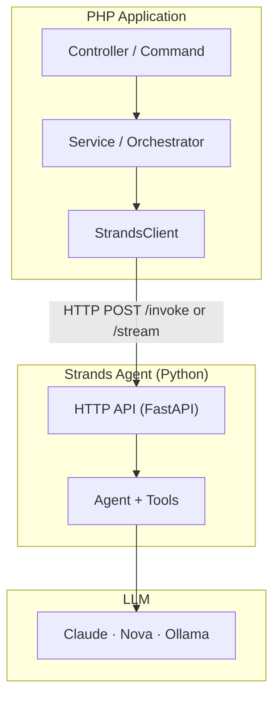
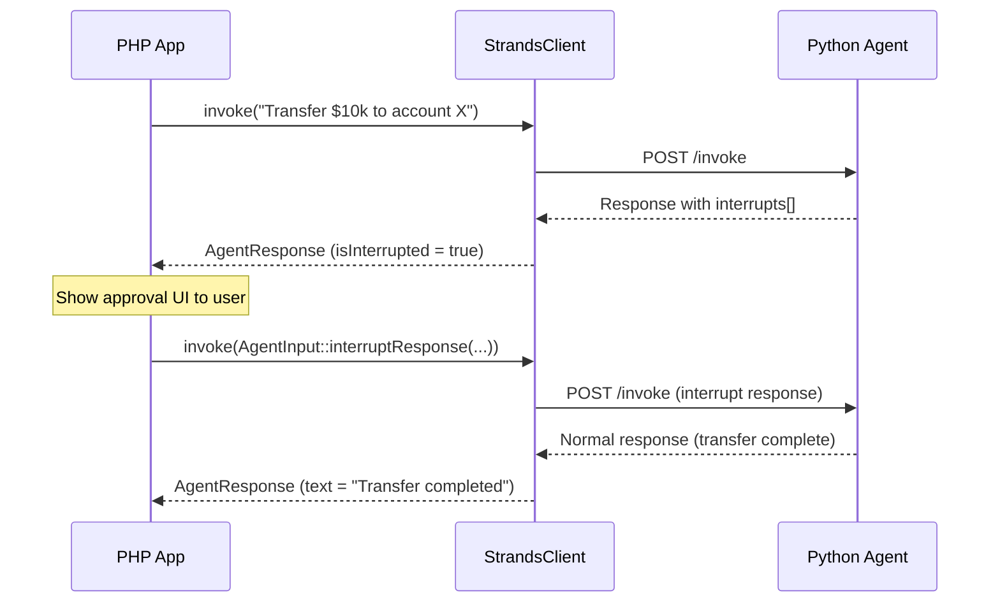

# Usage Guide

This guide covers real-world Strands PHP Client patterns, with examples from
[`the-summit-chatroom`](https://github.com/blundergoat/the-summit-chatroom), where three agents debate a decision in a Symfony application.

## Table of Contents

- [Architecture Overview](#architecture-overview)
- [Wire Contract](#wire-contract)
- [Basic Invoke](#basic-invoke)
- [Rich Input (AgentInput)](#rich-input-agentinput)
- [Streaming with SSE](#streaming-with-sse)
- [Custom Endpoints](#custom-endpoints)
- [Stream Cancellation](#stream-cancellation)
- [Interrupt Handling](#interrupt-handling)
- [Guardrail Traces](#guardrail-traces)
- [Response Metadata](#response-metadata)
- [Error Handling](#error-handling)
- [Session Management](#session-management)
- [Context Builder](#context-builder)
- [Authentication](#authentication)
- [Retries and Timeouts](#retries-and-timeouts)
- [Logging](#logging)
- [Symfony Integration](#symfony-integration)
- [Multi-Agent Orchestration](#multi-agent-orchestration)
- [Streaming to the Browser with Mercure](#streaming-to-the-browser-with-mercure)
- [Building Your Python Agent](#building-your-python-agent)
- [Migrating an Existing Wrapper](#migrating-an-existing-wrapper)
- [Troubleshooting](#troubleshooting)
- [Testing](#testing)

## Architecture Overview

A typical Strands application follows this pattern:


```mermaid
graph TB
    subgraph "PHP Application"
        Controller["Controller / Command"]
        Orchestrator["Service / Orchestrator"]
        Client["StrandsClient"]
    end

    subgraph "Strands Agent (Python)"
        API["HTTP API (FastAPI)"]
        Agent["Agent + Tools"]
    end

    subgraph "LLM"
        Model["Claude · Nova · Ollama"]
    end

    Controller --> Orchestrator
    Orchestrator --> Client
    Client -->|"HTTP POST /invoke or /stream"| API
    API --> Agent
    Agent --> Model
```

The PHP side never runs an agentic loop. It sends a message with optional context and a session ID, then receives one response or a stream of events.
Reasoning, tool calls, and conversation state stay in the Python agent service.

## Wire Contract

`StrandsClient` targets the [Strands HTTP Wire Contract](wire-contract.md), a PHP-facing JSON and SSE contract emitted by Python wrappers. It is not a
raw mirror of sdk-python `TypedDict` objects.

The wrapper translates between PHP request and response shapes and sdk-python messages, results, citations, guardrails, usage, and stream events.

## Basic Invoke

The simplest usage - send a message, get a response:

```php
use StrandsPhpClient\Config\StrandsConfig;
use StrandsPhpClient\StrandsClient;

$client = new StrandsClient(
    config: new StrandsConfig(endpoint: 'http://localhost:8081'),
);

$response = $client->invoke(message: 'Should we migrate to microservices?');

echo $response->text;                    // Agent's full response
echo $response->agent;                   // Which agent handled it (e.g. "analyst")
echo $response->sessionId;               // Session ID for follow-ups
echo $response->hasObjective ? 'yes' : 'no'; // Whether a secret objective was active
echo $response->usage->inputTokens;      // Tokens consumed
echo $response->usage->outputTokens;     // Tokens generated
echo $response->usage->totalTokens();    // Total tokens (input + output)
print_r($response->toolsUsed);           // Tools the agent called
print_r($response->metadata);           // Unknown fields plus deprecated 1.x aliases
print_r($response->wrapperMetadata);    // Canonical wrapper-owned metadata
```

`invoke()` blocks until the agent finishes its entire reasoning loop (including any tool calls) and returns the final response.

## Rich Input (AgentInput)

Use `AgentInput` for images, documents, videos, S3 locations, and wrapper-supported URL sources. It serializes those values to Wire Contract blocks.

```php
use StrandsPhpClient\Context\AgentInput;

// Text with an image
$input = AgentInput::text("What's in this image?")
    ->withImage(base64_encode(file_get_contents('photo.png')), 'image/png');

$response = $client->invoke(message: $input);

// Text with a PDF document
$input = AgentInput::text('Summarise this report')
    ->withDocument(base64_encode(file_get_contents('report.pdf')), 'pdf', 'Q4 Report');

// Document from S3 (no base64 needed)
$input = AgentInput::text('Summarise this report')
    ->withDocumentFromS3('s3://my-bucket/report.pdf', 'pdf', 'Q4 Report');

// Video from S3
$input = AgentInput::text('Describe what happens in this video')
    ->withVideoFromS3('s3://my-bucket/demo.mp4', 'mp4');

// Structured output prompt
$input = AgentInput::text('List the key findings')
    ->withStructuredOutputPrompt('Return a JSON array of strings');
```

With no content blocks, `AgentInput::text('hello')` serializes as the plain string `"hello"` for compatibility with simple-message wrappers.

For the full API reference and wire format details, see [rich-input.md](rich-input.md).

## Streaming with SSE

For real-time delivery, use `stream()`. Events arrive as the agent produces them, and the returned `StreamResult` contains the accumulated answer and
terminal metadata:

```php
use StrandsPhpClient\Streaming\StreamEvent;
use StrandsPhpClient\Streaming\StreamEventType;

$result = $client->stream(
    message: 'Explain quantum computing',
    onEvent: function (StreamEvent $event) {
        // Known event types this chat view does not render return null so streaming continues.
        match ($event->type) {
            StreamEventType::Text       => print($event->text),
            StreamEventType::ToolUse    => print("[Using tool: {$event->toolName}]"),
            StreamEventType::ToolResult => print("[Tool result: {$event->toolName}]"),
            StreamEventType::Thinking   => print("[Thinking...]"),
            StreamEventType::Complete   => print("\n[Done]"),
            StreamEventType::Error      => print("Error: {$event->errorMessage}"),
            default                     => null,
        };
    },
    sessionId: 'session-001',
);

// StreamResult has the accumulated data from the entire stream
echo $result->text;                          // Full text assembled from all Text events
echo $result->sessionId;                     // Session ID from the Complete event
echo $result->usage->inputTokens;            // Token usage
echo $result->usage->outputTokens;
echo $result->usage->totalTokens();          // Total tokens (input + output)
echo $result->textEvents;                    // Number of Text events received
echo $result->totalEvents;                   // All parsed events, including thinking, tools, citations, and terminal events
echo $result->timeToFirstTextTokenMs;        // Client-measured TTFT in milliseconds
echo $result->stopReason?->value;             // Known typed stop reason, when recognised
echo $result->rawStopReason;                  // Exact stop_reason, including future values
echo $result->isInterrupted() ? 'yes' : 'no'; // Whether the agent was interrupted
```

**Event types:**

| Type | Description | Key Fields |
|------|-------------|------------|
| `Text` | Content token | `$event->text` |
| `ToolUse` | Agent is calling a tool | `$event->toolName`, `$event->toolInput` |
| `ToolResult` | Tool returned a result | `$event->toolName`, `$event->toolResult` |
| `Thinking` | Agent is reasoning | `$event->text` |
| `Citation` | Source citation data | `$event->citation` |
| `ReasoningSignature` | Reasoning verification signature | `$event->reasoningSignature` |
| `ReasoningRedacted` | Redacted reasoning block | *(informational)* |
| `Complete` | Stream finished | `$event->fullText`, `$event->sessionId`, `$event->usage` |
| `Error` | Error occurred | `$event->errorCode`, `$event->errorMessage` |

`Complete` and `Error` are terminal events. If the stream ends without one, the client throws `StreamInterruptedException`.
When present, `has_objective` is exposed as `$event->hasObjective`.

> **Tip:** Keep `default => null` in callback `match` expressions. Unknown wire names are skipped; future typed enum cases fall through safely.

> **Note:** Streaming requires `symfony/http-client` via `SymfonyHttpTransport`. PSR-18 clients only support `invoke()`.

## Custom Endpoints

Use `postJson()` and `streamSse()` for file processing, metadata extraction, validation, or another custom endpoint. They preserve app-owned arrays.

### postJson() - Synchronous custom requests

```php
// Send an arbitrary JSON payload and get back a raw array
$result = $client->postJson('/file-summarise', [
    'file_base64' => base64_encode($fileBytes),
    'file_name' => 'report.pdf',
    'template' => 'executive-summary',
]);

echo $result['summary'];
echo $result['model'];
echo $result['confidence'];
```

`postJson()` reuses the authentication, retry, and timeout behaviour of `invoke()`, but accepts a custom path and returns a decoded array instead of
`AgentResponse`.

### streamSse() - Streaming custom requests

```php
// Stream raw SSE events from a custom endpoint
$client->streamSse('/file-summarise-stream', [
    'file_base64' => base64_encode($fileBytes),
], function (array $event) {
    // A missing or app-specific type produces no visible output but leaves every raw event field available to other handling.
    match ($event['type'] ?? '') {
        'progress' => printf("Processing: %d%%\n", $event['percent']),
        'text'     => print($event['content']),
        'complete' => print("\n[Done]"),
        default    => null,
    };
});
```

Unlike the typed events from `stream()`, `streamSse()` delivers decoded arrays, so domain fields such as `percent` reach the callback intact.

### Per-request timeout

Both custom methods accept an optional timeout in seconds that overrides the configured response timeout for that call:

```php
// Different timeouts for different operations, same client
$client->postJson('/file-metadata', $payload, timeout: 5);     // Fast: 5s
$client->postJson('/file-summarise', $payload, timeout: 120);   // Slow: 2min
$client->streamSse('/long-analysis', $payload, $callback, timeout: 300); // Very slow: 5min
```

Per-call timeouts avoid separate clients for fast and slow operations. A value below one second throws `InvalidArgumentException` before the request.

## Stream Cancellation

Both stream callbacks can return `false` to cancel. `SymfonyHttpTransport` then closes the HTTP response instead of merely ignoring later events.

### Cancelling a stream() call

```php
$maxTokens = 500;
$tokenCount = 0;

$result = $client->stream(
    message: 'Write a long essay',
    onEvent: function (StreamEvent $event) use (&$tokenCount, $maxTokens): bool {
        // Only visible text contributes to the user's requested display limit.
        if ($event->type === StreamEventType::Text) {
            $tokenCount++;
            print($event->text);

            // Reaching the limit closes the HTTP stream before more answer text reaches the screen.
            if ($tokenCount >= $maxTokens) {
                return false; // Cancel - HTTP connection closes immediately
            }
        }

        return true; // Continue
    },
);

// $result contains whatever was accumulated before cancellation
echo "\nReceived {$result->textEvents} text events";
```

### Cancelling a streamSse() call

```php
// Cancel when the browser disconnects
$client->streamSse('/long-analysis', $payload, function (array $event): bool {
    broadcast($event);

    return !connection_aborted(); // false = abort stream
});
```

### Backward compatibility

A callback with no explicit return continues the stream. Only the literal `false` cancels, so existing `void` callbacks retain their behaviour.

## Interrupt Handling

When a tool requires approval, the agent returns an **interrupt** instead of executing it. The response identifies the action and how to resume.


```mermaid
sequenceDiagram
    participant App as PHP App
    participant Client as StrandsClient
    participant Agent as Python Agent

    App->>Client: invoke("Transfer $10k to account X")
    Client->>Agent: POST /invoke
    Agent-->>Client: Response with interrupts[]
    Client-->>App: AgentResponse (isInterrupted = true)

    Note over App: Show approval UI to user

    App->>Client: invoke(AgentInput::interruptResponse(...))
    Client->>Agent: POST /invoke (interrupt response)
    Agent-->>Client: Normal response (transfer complete)
    Client-->>App: AgentResponse (text = "Transfer completed")
```

### Detecting interrupts (invoke)

```php
$response = $client->invoke(
    message: 'Transfer $10,000 to account ACCT-789',
    sessionId: 'session-001',
);

// An interrupted response becomes one or more approval cards in the UI.
if ($response->isInterrupted()) {
    // Each interrupt describes one paused tool action the user can review.
    foreach ($response->interrupts as $interrupt) {
        echo "Tool: {$interrupt->toolName}\n";       // e.g. "bank_transfer"
        echo "Reason: {$interrupt->reason}\n";        // e.g. "Amount exceeds $1,000 limit"
        print_r($interrupt->toolInput);               // ['amount' => 10000, 'account' => 'ACCT-789']
        echo "Interrupt ID: {$interrupt->interruptId}\n";
    }
}
```

### Resuming after an interrupt

Build the resume input from the returned `InterruptDetail`. It prefers `interruptId`, falls back to `toolUseId`, and throws if the wrapper supplied
neither identifier:

```php
// User approved the action
$resumeInput = $interrupt->toResumeInput(['approved' => true]);

$response = $client->invoke(
    message: $resumeInput,
    sessionId: 'session-001', // Same session to continue the conversation
);

echo $response->text; // "Transfer of $10,000 to ACCT-789 completed successfully."
```

### Detecting interrupts (stream)

```php
$result = $client->stream(
    message: 'Transfer $10,000 to account ACCT-789',
    onEvent: function (StreamEvent $event) {
        // Known event types this approval view does not render return null so streaming continues.
        match ($event->type) {
            StreamEventType::Text     => print($event->text),
            StreamEventType::Complete => print("\n[Done]"),
            default                   => null,
        };
    },
    sessionId: 'session-001',
);

// A terminal interrupt becomes the approval state shown after live text stops.
if ($result->isInterrupted()) {
    // Each item is the same InterruptDetail type returned by invoke().
    foreach ($result->interrupts as $interrupt) {
        echo "Needs approval: {$interrupt->toolName}\n";
    }
}
```

For more details and diagrams, see [interrupts-and-guardrails.md](interrupts-and-guardrails.md).

## Guardrail Traces

When the agent uses content or topic guardrails, the response may include a **guardrail trace** that explains whether a policy intervened.

```php
$response = $client->invoke(
    message: 'How do I pick a lock?',
    sessionId: 'session-001',
);

// Guardrail detail lets the UI explain why it shows a replacement answer.
if ($response->guardrailTrace !== null) {
    echo "Action: {$response->guardrailTrace->action}\n"; // 'INTERVENED' or 'NONE'

    // Typed assessments avoid wrapper-specific array-key checks in a policy-details panel.
    foreach ($response->guardrailTrace->getAssessmentObjects() as $assessment) {
        echo 'Policy: ' . ($assessment->name ?? $assessment->type ?? 'unknown') . "\n";
        echo 'Result: ' . ($assessment->result ?? $assessment->action ?? 'unknown') . "\n";
    }
}
```

`modelOutput` may contain the unsafe text the guardrail replaced. Do not render it in a normal UI or write it to application logs. Restrict access to
an explicitly authorized audit workflow with suitable retention controls.

Guardrail traces are also available on `StreamResult`:

```php
$result = $client->stream(
    message: 'How do I pick a lock?',
    onEvent: function (StreamEvent $event) {
        // Known event types this guardrail view does not render return null so streaming continues.
        match ($event->type) {
            StreamEventType::Text => print($event->text),
            default               => null,
        };
    },
);

// A streamed replacement answer uses the same guardrail detail as invoke().
if ($result->guardrailTrace !== null) {
    echo "Guardrail action: {$result->guardrailTrace->action}\n";
}
```

For more details and diagrams, see [interrupts-and-guardrails.md](interrupts-and-guardrails.md).

## Response Metadata

`AgentResponse` keeps unrecognised top-level fields in `metadata`, so a newer wrapper can add data without an immediate PHP client update.
Fields promoted to dedicated 1.5 properties remain in their former metadata locations throughout 1.x. New code should use `$wrapperMetadata`,
`$contextSize`, and `$projectedContextSize`; the duplicated array keys are deprecated for removal in 2.0.

```php
$response = $client->invoke(message: 'Hello');

// Known fields are typed properties
echo $response->text;
echo $response->agent;
echo $response->sessionId;

// Unknown fields land in metadata
print_r($response->metadata);
// e.g. ['model_id' => 'claude-sonnet-4-20250514', 'metadata' => [...], 'context_size' => 8192]

// New code reads top-level wrapper metadata here
print_r($response->wrapperMetadata);
```

The following fields are **not** included in `metadata` because they already had dedicated 1.x handling: `text`, `agent`, `session_id`, `usage`,
`tools_used`, `has_objective`, `stop_reason`, `structured_output`, `interrupts`, `guardrail_trace`, `trace`, and `message`. The promoted `metadata`,
`context_size`, and `projected_context_size` fields are deliberate compatibility exceptions until 2.0: each has a canonical property and a deprecated
legacy array alias.

## Error Handling

`AgentErrorException` carries the full decoded JSON response body for structured error inspection:

```php
use StrandsPhpClient\Exceptions\AgentErrorException;

try {
    $client->postJson('/validate', $payload);
} catch (AgentErrorException $agentError) {
    // For example, a validation screen may receive a structured 422 response from its custom endpoint.
    echo $agentError->statusCode;    // 422
    echo $agentError->getMessage();  // "Validation failed"

    // A JSON error body can populate field-level feedback; a plain-text server error leaves it null.
    if ($agentError->responseBody !== null) {
        print_r($agentError->responseBody);
        // ['detail' => 'Validation failed', 'errors' => ['field' => 'required']]
    }
}
```

`responseBody` is null when the server returned non-JSON content, such as a proxy error page. Both built-in transports preserve decoded JSON errors.

### Exception hierarchy

| Exception | When | Key Properties |
|-----------|------|----------------|
| `StrandsException` | Base class for all library errors | Standard exception |
| `AgentErrorException` | HTTP 4xx/5xx from the agent | `$statusCode`, `$errorCode`, `$responseBody` |
| `ThrottledException` | HTTP 429 after automatic retries are exhausted | Same fields as `AgentErrorException` |
| `ContextOverflowException` | Agent error code identifies a context overflow | Same fields as `AgentErrorException` |
| `MaxTokensException` | Agent error code contains `max_tokens` | Same fields as `AgentErrorException` |
| `StreamInterruptedException` | Stream ended without terminal event | Standard exception |

## Session Management

Sessions enable multi-turn conversations. The client sends a `session_id` - the Python agent manages all state server-side.

```php
// The first turn establishes the conversation the user can refine.
$draftResponse = $client->invoke(
    message: 'Draft a referral letter for a patient',
    sessionId: 'consult-001',
);

// Reusing the session lets the agent revise the answer with the earlier turn in context.
$revisedResponse = $client->invoke(
    message: 'Make it more formal and add the diagnosis',
    sessionId: 'consult-001',
);
```

**How `the-summit-chatroom` handles sessions:**

The browser generates a UUID per tab and sends it with every request:

```javascript
// Browser-side session management
let sessionId = sessionStorage.getItem('summit_session_id');
// A new browser tab gets a conversation ID that later requests in that tab reuse.
if (!sessionId) {
    sessionId = crypto.randomUUID();
    sessionStorage.setItem('summit_session_id', sessionId);
}

// Sent with every request
fetch('/chat', {
    method: 'POST',
    body: JSON.stringify({
        message: message,
        session_id: sessionId,
    }),
});
```

The controller passes it through to the client:

```php
// A missing session starts a one-shot turn; a valid string continues that browser conversation.
$sessionId = is_string($data['session_id'] ?? null) ? $data['session_id'] : null;

$response = $client->invoke(
    message: $message,
    sessionId: $sessionId,
);
```

A session ID locates conversation state; it is not authorization. Bind every stored session to the authenticated user or tenant and reject an ID that
belongs to someone else.

**Session sharing across agents:** In `the-summit-chatroom`, all agents receive one `session_id`. Shared history lets each see earlier answers.

## Context Builder

`AgentContext` is an immutable builder for application context. Every `with*()` call returns a new instance, leaving prior inputs unchanged.

```php
use StrandsPhpClient\Context\AgentContext;

$context = AgentContext::create()
    ->withMetadata('persona', 'analyst')
    ->withMetadata('user_role', 'practitioner')
    ->withSystemPrompt('You are a clinical documentation assistant.')
    ->withPermission('read:patients')
    ->withPermission('write:notes')
    ->withDocument('referral.pdf', base64_encode($pdfBytes), 'application/pdf')
    ->withStructuredData('patient', [
        'id' => 'P-123',
        'name' => 'Jane Doe',
        'age' => 42,
    ]);

$response = $client->invoke(
    message: 'Summarise this referral',
    context: $context,
    sessionId: 'consult-001',
);
```

**What `the-summit-chatroom` passes as context:**

Each agent gets a `persona` metadata field that tells the Python agent which system prompt to use:

```php
$context = AgentContext::create()->withMetadata('persona', $persona);

$response = $client->invoke(
    message: $message,
    context: $context,
    sessionId: $sessionId,
);
```

One endpoint can select a persona from metadata instead of exposing three routes. The Python wrapper reads `context.metadata.persona` and applies the
matching system prompt.

## Authentication

The client supports pluggable authentication strategies. See the [authentication guide](auth.md) for the full reference.

**No auth (local dev - the default):**

```php
$config = new StrandsConfig(endpoint: 'http://localhost:8081');
```

**API key auth (production):**

```php
use StrandsPhpClient\Auth\ApiKeyAuth;

$config = new StrandsConfig(
    endpoint: 'https://api.example.com/agent',
    auth: new ApiKeyAuth('sk-your-api-key'),
);
```

**Custom header:**

```php
$config = new StrandsConfig(
    endpoint: 'https://api.example.com/agent',
    auth: new ApiKeyAuth('sk-key', headerName: 'X-API-Key', valuePrefix: ''),
);
```

**SigV4 auth (AWS API Gateway with IAM):**

```php
use StrandsPhpClient\Auth\SigV4Auth;

// Use this only when the PHP process already contains the AWS credential variables.
$config = new StrandsConfig(
    endpoint: 'https://abc123.execute-api.us-east-1.amazonaws.com/prod',
    auth: SigV4Auth::fromEnvironment(region: 'us-east-1'),
);

// Explicit credentials
$config = new StrandsConfig(
    endpoint: 'https://abc123.execute-api.us-east-1.amazonaws.com/prod',
    auth: new SigV4Auth(
        accessKeyId: 'your-access-key-id',
        secretAccessKey: 'your-secret-access-key',
        region: 'us-east-1',
    ),
);

// Temporary credentials (STS assumed role)
$config = new StrandsConfig(
    endpoint: 'https://abc123.execute-api.us-east-1.amazonaws.com/prod',
    auth: new SigV4Auth(
        accessKeyId: 'your-temporary-access-key-id',
        secretAccessKey: 'your-temporary-secret-access-key',
        region: 'us-east-1',
        sessionToken: 'your-session-token',
    ),
);
```

`SigV4Auth` does not require `aws/aws-sdk-php`. Its `fromEnvironment()` factory reads only `AWS_ACCESS_KEY_ID`, `AWS_SECRET_ACCESS_KEY`, and optional
`AWS_SESSION_TOKEN`; it does not query instance profiles, ECS task credentials, Lambda roles, shared profiles, or another provider chain. Resolve role
credentials separately, then inject or pass all required values.

## Retries and Timeouts

For production reliability, configure retries with exponential backoff:

```php
$config = new StrandsConfig(
    endpoint: 'https://api.example.com/agent',
    timeout: 120,           // Response timeout in seconds (default: 120)
    connectTimeout: 5,      // TCP connection timeout (default: 10)
    maxRetries: 3,          // Retry up to 3 times on 429/502/503/504
    retryDelayMs: 500,      // Base waits are 500ms → 1s → 2s; each actual wait is randomized to 50–100%
);
```

`connectTimeout` lets an unreachable server fail quickly without shortening the response timeout needed for model generation and tool calls.

Retries apply to `invoke()` and `postJson()` calls. Streaming requests (`stream()`, `streamSse()`) are not retried.

## Logging

`StrandsClient` accepts an optional PSR-3 logger. It logs:

- `debug` - Request URLs, response metadata (session ID, token usage, event counts)
- `warning` - Retry attempts with delay and error details

Session IDs and upstream errors can be sensitive. Apply the application's access, redaction, and retention controls to these logs. OpenTelemetry spans
record only whether a session is present, never its value.

```php
use Psr\Log\LoggerInterface;

// Vanilla PHP - pass any PSR-3 logger
$client = new StrandsClient(
    config: $config,
    logger: $yourMonologLogger,
);

// Symfony - injected automatically via the bundle
// All StrandsClient instances get the app's logger for free
```

## Symfony Integration

The Symfony bundle registers named `StrandsClient` services from YAML. See the [Symfony configuration reference](symfony-config.md) for every option.

### Configuration

```yaml
# config/packages/strands.yaml
strands:
    agents:
        analyst:
            endpoint: '%env(AGENT_ENDPOINT)%'
            timeout: 300
        skeptic:
            endpoint: '%env(AGENT_ENDPOINT)%'
            timeout: 300
            auth:
                driver: api_key
                api_key: '%env(AGENT_API_KEY)%'
        strategist:
            endpoint: '%env(AGENT_ENDPOINT)%'
            timeout: 300
            max_retries: 2
```

Each agent entry creates a service named `strands.client.<name>`.

### Injection with #[Autowire]

Inject named clients into your services using Symfony's `#[Autowire]` attribute:

```php
use Symfony\Component\DependencyInjection\Attribute\Autowire;

use StrandsPhpClient\StrandsClient;

/**
 * Receives the specialist agents used by a council-style answer screen.
 *
 * Use this orchestrator when analyst, skeptic, and strategist responses contribute to one user decision.
 * Its workflow methods call the named clients in the order the interface presents them.
 */
final class SummitCouncilOrchestrator
{
    /** Inject each named agent once so a request never needs a runtime service lookup. */
    public function __construct(
        #[Autowire(service: 'strands.client.analyst')]
        private readonly StrandsClient $analyst,

        #[Autowire(service: 'strands.client.skeptic')]
        private readonly StrandsClient $skeptic,

        #[Autowire(service: 'strands.client.strategist')]
        private readonly StrandsClient $strategist,
    ) {
    }
}
```

The bundle detects `symfony/http-client`, creates `SymfonyHttpTransport` instances, and injects the application's PSR-3 logger.

### Bundle registration

```php
// config/bundles.php
return [
    Symfony\Bundle\FrameworkBundle\FrameworkBundle::class => ['all' => true],
    StrandsPhpClient\Integration\Symfony\StrandsBundle::class => ['all' => true],
    // ...
];
```

## Multi-Agent Orchestration

`the-summit-chatroom` demonstrates a **council pattern**: agents run sequentially in one session, so each can build on earlier answers.

### Synchronous orchestration

All three agents are called in sequence. Each sees what prior agents said via the shared session:

```php
use StrandsPhpClient\Context\AgentContext;
use StrandsPhpClient\StrandsClient;

/**
 * Collects three specialist answers for one council result.
 *
 * Use it when a decision screen presents analysis, challenge, and synthesis in a fixed order.
 * Reusing one non-empty session ID lets later agents receive the earlier conversation history.
 */
final class SummitCouncilOrchestrator
{
    /** Inject the three agents whose answers make up the council result. */
    public function __construct(
        private readonly StrandsClient $analyst,
        private readonly StrandsClient $skeptic,
        private readonly StrandsClient $strategist,
    ) {
    }

    /**
     * Ask each specialist for its part of the answer shown to the user.
     * Pass the authenticated conversation ID shared by all three calls; an empty ID would lose the council's shared history.
     *
     * @param string $decisionQuestion User's decision question; an empty value is rejected before this method is called.
     * @param string $sessionId Authorized conversation ID; an empty value must be rejected so every specialist shares the same history.
     * @return list<array{persona: string, text: string}> Three ordered cards for the council-results screen; never empty on success.
     */
    public function buildCouncilCards(string $decisionQuestion, string $sessionId): array
    {
        $specialistClients = [
            'analyst'    => $this->analyst,
            'skeptic'    => $this->skeptic,
            'strategist' => $this->strategist,
        ];

        // Start with no result cards because each specialist contributes one in turn.
        $councilResponses = [];

        // Each named client produces the next card in the order the user reads the debate.
        foreach ($specialistClients as $persona => $specialistClient) {
            $agentContext = AgentContext::create()->withMetadata('persona', $persona);

            $specialistResponse = $specialistClient->invoke(
                message: $decisionQuestion,
                context: $agentContext,
                sessionId: $sessionId,
            );

            $councilResponses[] = [
                'persona' => $persona,
                'text' => $specialistResponse->text,
            ];
        }

        return $councilResponses;
    }
}
```

**How the council debate works:**

1. **Analyst** goes first - analyses the question with no prior context
2. **Skeptic** goes second - the shared session contains the Analyst's response, so the Skeptic can challenge it
3. **Strategist** goes third - sees both the Analyst and Skeptic's arguments and synthesises a recommendation

### Controller wiring

The route must verify that `session_id` belongs to the authenticated user or tenant. The following fragment handles payload validation after that
ownership check:

```php
use Symfony\Bundle\FrameworkBundle\Controller\AbstractController;
use Symfony\Component\HttpFoundation\JsonResponse;
use Symfony\Component\HttpFoundation\Request;
use Symfony\Component\Routing\Attribute\Route;

/**
 * Validates one decision question before starting the council workflow.
 *
 * Use this controller for a chat route whose access-control layer already verifies conversation ownership.
 * Its JSON response contains validation feedback or the three cards the browser renders.
 */
final class CouncilController extends AbstractController
{
    /** Inject the workflow that asks all three specialist agents. */
    public function __construct(
        private readonly SummitCouncilOrchestrator $orchestrator,
    ) {
    }

    /**
     * Validate a chat submission and return the ordered council cards the browser will render.
     *
     * @param Request $request JSON chat request; an empty or malformed body returns validation feedback.
     * @return JsonResponse Three result cards on success, or a non-empty validation error with HTTP 422.
     */
    #[Route('/chat', name: 'chat_submit', methods: ['POST'])]
    public function submit(Request $request): JsonResponse
    {
        $decodedRequest = json_decode($request->getContent(), true);

        // Malformed or non-object JSON becomes an empty input map so the route can return normal validation feedback.
        $submittedChat = is_array($decodedRequest) ? $decodedRequest : [];
        // A missing or non-string message becomes empty and is rejected before an agent request starts.
        $decisionQuestion = is_string($submittedChat['message'] ?? null) ? trim($submittedChat['message']) : '';

        // An empty message cannot produce a useful council answer, so return feedback the chat form can display.
        if ($decisionQuestion === '') {
            return $this->json(['error' => 'Enter a question for the council.'], 422);
        }

        // A missing or non-string session ID becomes empty and cannot identify the shared council conversation.
        $sessionId = is_string($submittedChat['session_id'] ?? null) ? trim($submittedChat['session_id']) : '';

        // Without one authorized session ID, later specialists would not receive the answers already shown to this user.
        if ($sessionId === '') {
            return $this->json(['error' => 'Start or select a conversation before asking the council.'], 422);
        }

        $councilResponses = $this->orchestrator->buildCouncilCards($decisionQuestion, $sessionId);

        return $this->json([
            'responses' => $councilResponses,
            'session_id' => $sessionId,
        ]);
    }
}
```

## Streaming to the Browser with Mercure

`the-summit-chatroom` uses [Mercure](https://mercure.rocks/) to push stream events from PHP to the browser. The same pattern works for any application
that must render tokens as they arrive.

### The streaming orchestrator

```php
use Symfony\Component\DependencyInjection\Attribute\Autowire;
use Symfony\Component\Mercure\HubInterface;
use Symfony\Component\Mercure\Update;

use StrandsPhpClient\Context\AgentContext;
use StrandsPhpClient\StrandsClient;
use StrandsPhpClient\Streaming\StreamEvent;
use StrandsPhpClient\Streaming\StreamEventType;

/**
 * Streams each specialist's progress to its own Mercure topic.
 *
 * Use it when a council screen renders analyst, skeptic, and strategist cards as their text arrives.
 * Tool and terminal events keep each card's activity and completion state synchronized with the agent.
 */
final class SummitCouncilStreamOrchestrator
{
    /** Inject every named agent plus the Mercure hub that updates the browser. */
    public function __construct(
        #[Autowire(service: 'strands.client.analyst')]
        private readonly StrandsClient $analyst,

        #[Autowire(service: 'strands.client.skeptic')]
        private readonly StrandsClient $skeptic,

        #[Autowire(service: 'strands.client.strategist')]
        private readonly StrandsClient $strategist,

        private readonly HubInterface $hub,
    ) {
    }

    /**
     * Stream the three specialist cards for one decision question and shared conversation.
     * Use a private, authorized topic base so only this user's browser can receive the updates.
     *
     * @param string $decisionQuestion User's question; an empty value must be rejected before streaming begins.
     * @param string $sessionId Authorized conversation ID; an empty value cannot safely share history between specialists.
     * @param string $topicBase Private Mercure topic prefix; an empty value cannot route updates to the correct browser.
     * @return void Publishes card updates as they arrive; the caller receives no separate result payload.
     */
    public function streamCouncilCards(
        string $decisionQuestion,
        string $sessionId,
        string $topicBase,
    ): void {
        $specialistClients = [
            'analyst'    => $this->analyst,
            'skeptic'    => $this->skeptic,
            'strategist' => $this->strategist,
        ];

        // Each specialist publishes to a separate topic so its card can update independently.
        foreach ($specialistClients as $persona => $specialistClient) {
            $browserTopic = "{$topicBase}/{$persona}";
            $agentContext = AgentContext::create()->withMetadata('persona', $persona);

            $specialistClient->stream(
                message: $decisionQuestion,
                onEvent: function (StreamEvent $streamEvent) use ($browserTopic, $persona) {
                    // Events without visible council-card output return null so streaming continues.
                    match ($streamEvent->type) {
                        StreamEventType::Text => $this->publishCardUpdate($browserTopic, [
                            'type' => 'text',
                            'persona' => $persona,
                            'content' => $streamEvent->text,
                        ]),
                        StreamEventType::ToolUse => $this->publishCardUpdate($browserTopic, [
                            'type' => 'tool_use',
                            'persona' => $persona,
                            'tool_name' => $streamEvent->toolName,
                        ]),
                        StreamEventType::Complete => $this->publishCardUpdate($browserTopic, [
                            'type' => 'complete',
                            'persona' => $persona,
                        ]),
                        StreamEventType::Error => $this->publishCardUpdate($browserTopic, [
                            'type' => 'error',
                            'persona' => $persona,
                            'message' => $streamEvent->errorMessage,
                        ]),
                        default => null,
                    };
                },
                context: $agentContext,
                sessionId: $sessionId,
            );
        }
    }

    /**
     * Publish one safe event map to the browser topic for a specialist card.
     * An empty payload is valid and lets the UI react to an event type without extra detail.
     *
     * @param string $browserTopic Authorized card topic; an empty value cannot route the update to the intended browser.
     * @param array<string, mixed> $eventPayload Event fields the browser may render; empty means the type alone carries the update.
     * @return void Publishes one private update and returns no response body.
     * @throws \RuntimeException When the event cannot be encoded for the browser.
     */
    private function publishCardUpdate(string $browserTopic, array $eventPayload): void
    {
        $encodedUpdate = json_encode($eventPayload);

        // Encoding failure means the browser cannot receive a trustworthy update for this agent card.
        if ($encodedUpdate === false) {
            throw new \RuntimeException('Could not encode the council stream event.');
        }

        // Private delivery requires a subscriber JWT, preventing another browser from reading this user's council cards.
        $this->hub->publish(new Update($browserTopic, $encodedUpdate, true));
    }
}
```

### Deferring streaming to kernel.terminate

The controller responds first and starts streaming during `kernel.terminate`, giving the browser time to subscribe before tokens arrive. This
fragment runs after the controller has validated a non-empty `$decisionQuestion` and an app-owned `$sessionId` for the current user:

```php
// Streaming starts only after the user selects live mode and the optional browser-stream service is available.
if ($streaming && $this->streamOrchestrator !== null) {
    $streamOrchestrator = $this->streamOrchestrator;
    $topicBase = 'https://app.example/council/' . rawurlencode($sessionId);

    // Deferring the agent calls lets the browser receive its topic and subscribe before the first card update arrives.
    $this->eventDispatcher->addListener(
        'kernel.terminate',
        static function () use ($streamOrchestrator, $decisionQuestion, $sessionId, $topicBase): void {
            $streamOrchestrator->streamCouncilCards($decisionQuestion, $sessionId, $topicBase);
        },
    );

    return $this->json([
        'status' => 'streaming',
        'session_id' => $sessionId,
        'topic' => $topicBase,
    ]);
}
```

### Browser-side: subscribing to the stream

Configure [Mercure subscriber authorization](https://symfony.com/doc/current/mercure.html#authorization) for the three private topics. When the hub
uses its authorization cookie, the browser can subscribe with:

```javascript
const subscribedTopics = ['analyst', 'skeptic', 'strategist']
    .map((persona) => `${topicBase}/${persona}`)
    .map((browserTopic) => `topic=${encodeURIComponent(browserTopic)}`)
    .join('&');
const councilEvents = new EventSource(`${mercureUrl}?${subscribedTopics}`, { withCredentials: true });

councilEvents.onmessage = (mercureMessage) => {
    const cardUpdate = JSON.parse(mercureMessage.data);

    switch (cardUpdate.type) {
        case 'text':
            appendToken(cardUpdate.persona, cardUpdate.content);
            break;
        case 'tool_use':
            showToolActivity(cardUpdate.persona, cardUpdate.tool_name);
            break;
        case 'complete':
            markAgentDone(cardUpdate.persona);
            break;
        case 'error':
            showError(cardUpdate.persona, cardUpdate.message);
            break;
    }
};
```

## Building Your Python Agent

The PHP client expects its Python wrapper to emit the JSON and SSE shapes in the [wire contract](wire-contract.md). This section covers the wrapper
boundary, common sdk-python pitfalls, and the maintained gateway example.

The maintained starting point is [examples/python-gateway](../examples/python-gateway). It is source-repository example code, excluded from Composer
archives, and is not a published Python package. It includes a fake-agent `/invoke`, `/stream`, `/health`, custom endpoint blueprint, sdk-python
normalization helpers, SSRF-safe URL-media validation, and FastAPI trace-context continuation middleware.

Run its contract smoke check without model credentials:

```bash
PYTHONDONTWRITEBYTECODE=1 python3 examples/python-gateway/tests/smoke_contract.py
```

### JSON payload the PHP client sends

When you call `$client->invoke()` or `$client->stream()`, the PHP client sends a POST request with this JSON body:

```json
{
    "message": "Should we migrate to microservices?",
    "session_id": "550e8400-e29b-41d4-a716-446655440000",
    "context": {
        "metadata": {
            "persona": "analyst",
            "user_role": "practitioner"
        }
    }
}
```

- `message` (string or rich-input object, required) - The user's message or serialized `AgentInput`.
- `session_id` (string, optional) - Application-owned conversation identifier. Omit it for a one-shot request.
- `context` (object, optional) - Application context from `AgentContext`. Only non-empty `system_prompt`, `metadata`, `permissions`, `documents`, and
  `structured_data` fields are included.

### SSE event contract (streaming)

For `/stream`, the PHP client's `StreamParser` expects Server-Sent Events with `data:` lines containing JSON. Each event must have a `type` field:

| Type | Required Fields | Description |
|------|----------------|-------------|
| `text` | `content` | A piece of generated text (token) |
| `thinking` | `content` | Agent reasoning text when the wrapper exposes it |
| `tool_use` | `tool_name`, `tool_input` | Agent is calling a tool |
| `tool_result` | `result` | Tool returned a result |
| `citation` | `citation` | Wrapper-normalized citation block |
| `reasoning_signature` | `signature` | Reasoning verification signature |
| `reasoning_redacted` | - | Reasoning content was redacted |
| `complete` | `text` | Stream finished - includes full response text |
| `error` | `message` | Stream failed - includes error description |

Every stream **must** end with `complete` or `error`. A connection that closes first produces `StreamInterruptedException` in PHP.

Example SSE output:

```
data: {"type": "text", "content": "The"}

data: {"type": "text", "content": " answer"}

data: {"type": "text", "content": " is 42."}

data: {"type": "complete", "text": "The answer is 42.", "session_id": "abc-123", "usage": {}, "tools_used": []}
```

### OpenTelemetry trace continuation

When tracing is configured, PHP injects W3C `traceparent` and `tracestate` headers. The wrapper extracts them and starts child spans.

The reference middleware in `examples/python-gateway/tracing.py` records only operation, sanitized route, and wire version. Never attach prompts,
responses, documents, filenames, raw context or tool payloads, or session ID values to spans.

For custom endpoints, record only sanitized route, status, duration, event counts, terminal state, and safe usage. Never inspect app-owned payloads.

### Calling the Strands SDK correctly

> **This is the most common pitfall.** Getting this wrong produces generic responses that ignore the user's question entirely.

The Strands SDK `Agent` class accepts conversation input as the **first positional argument** (`prompt`), which supports multiple formats:

```python
# String - single-turn conversation
result = agent("Should we migrate to microservices?")

# Messages list - multi-turn conversation with history
result = agent(messages)

# Async streaming
async for event in agent.stream_async(messages):
    ...
```

**Common mistake - passing messages as a keyword argument:**

```python
# WRONG - "messages" goes into **kwargs, not the prompt parameter.
# The agent runs with no conversation history and sees only its system prompt.
result = agent(messages=messages)
async for event in agent.stream_async(messages=messages):  # Also wrong.
    ...
```

This is wrong because the SDK signature is:

```python
def __call__(self, prompt=None, *, invocation_state=None, **kwargs):
    ...
```

Passing `messages=messages` puts the list into deprecated `**kwargs`, not `prompt`. The agent then runs without that conversation input.

### Message content format

The Strands SDK expects message content as a **list of content blocks**, not a plain string:

```python
# WRONG - the SDK will iterate over characters, not words
messages = [{"role": "user", "content": "Hello world"}]

# CORRECT - content is a list of ContentBlock dicts
messages = [{"role": "user", "content": [{"text": "Hello world"}]}]
```

If your session store uses plain strings internally (which is simpler), convert before passing to the SDK:

```python
from typing import Any


def to_sdk_messages(stored_messages: list[dict[str, Any]]) -> list[dict[str, Any]]:
    """Convert stored conversation turns into the content-block lists expected by Strands.
    Use this at the SDK boundary; an empty history returns an empty list and starts no conversation."""
    # Start with no SDK turns because each stored message contributes one normalized item.
    sdk_messages = []

    # Preserve conversation order so the agent sees the same sequence the user saw.
    for stored_message in stored_messages:
        message_content = stored_message["content"]
        # Plain text becomes one content block; an existing block list passes through unchanged.
        if isinstance(message_content, str):
            message_content = [{"text": message_content}]

        sdk_messages.append({"role": stored_message["role"], "content": message_content})

    return sdk_messages
```

### Start from the maintained FastAPI gateway

Use [`examples/python-gateway`](../examples/python-gateway) as the starting point. Its credential-free fake agent exercises the same boundaries as a
real wrapper.

When replacing the fake response with `Agent`:

1. Pass the prompt or message list as the first positional argument to `agent()` or `agent.stream_async()`.
2. Remove only the single newline that `AgentResult.__str__()` appends: `str(agent_result).removesuffix("\n")`.
3. Pass every mapping callback through `map_sdk_event(..., fallback_session_id=request.session_id)` and skip a `None` result.
4. Frame only normalized events with `sse_frame()`, stop after the first terminal event, and emit a safe `error` if the SDK ends first.
5. Log internal exceptions on the server, but send the PHP caller a stable error code and safe message rather than `str(error)`.

The streaming adapter is intentionally small:

```python
import logging
from collections.abc import AsyncIterator, Mapping
from typing import Any

from contract import map_sdk_event, sse_frame

logger = logging.getLogger(__name__)


async def normalized_frames(
    agent: Any,
    sdk_messages: list[dict[str, Any]],
    session_id: str | None,
) -> AsyncIterator[str]:
    """Translate one real Agent stream into the SSE frames consumed by PHP.

    Use it as the StreamingResponse body; a None session means the caller started a one-shot turn.
    """
    try:
        # The message list is the positional prompt; passing messages= would leave it in deprecated kwargs.
        async for sdk_event in agent.stream_async(sdk_messages):
            # Lifecycle values without a mapping shape cannot become Wire Contract events.
            if not isinstance(sdk_event, Mapping):
                continue

            normalized_event = map_sdk_event(sdk_event, fallback_session_id=session_id)
            # None identifies a lifecycle or incomplete update that should stay invisible to the user.
            if normalized_event is None:
                continue

            framed_event = sse_frame(normalized_event)
            # The first terminal frame finalizes the PHP result, so later SDK callbacks must not create another ending.
            if normalized_event.get("type") in {"complete", "error"}:
                yield framed_event
                return

            yield framed_event
    # For example, the model provider may disconnect while the user is watching the answer stream.
    except Exception:
        logger.exception("Agent stream failed before a terminal event")
        yield sse_frame({"type": "error", "message": "The agent stream failed.", "code": "agent_stream_failed"})
        return

    # If the SDK closes without a result, send an explicit error so PHP does not discard the partial answer as an unexplained interruption.
    yield sse_frame({"type": "error", "message": "The agent stream ended early.", "code": "agent_stream_incomplete"})
```

The template echoes `session_id` but deliberately does not persist conversation history. A production wrapper needs an application-owned session store
with authorization, concurrency control, bounded retention, and expiry.
[`the-summit-chatroom`](https://github.com/blundergoat/the-summit-chatroom) shows one council integration; choose storage that fits your deployment.

## Migrating an Existing Wrapper

Existing FastAPI wrappers do not need an all-at-once rewrite. Current PHP call sites remain compatible while the wrapper adopts the shared contract in
stages:

1. **Keep custom routes app-owned.** The contract standardizes only `/invoke`, `/stream`, and optional discovery; custom schemas stay unchanged.
2. **Adopt normalization helpers.** Use [`extract_usage()` and `map_sdk_event()`](../examples/python-gateway/contract.py), or port their behaviour.
3. **Continue traces.** Add [`TraceContextMiddleware`](../examples/python-gateway/tracing.py) so PHP's `traceparent` parents wrapper spans.
4. **Validate shared fixtures.** Compare real wrapper responses with `tests/Fixtures/wire-contract/`, which the PHP contract tests also parse.

The wrapper stays yours; only the helpers and the canonical envelope shapes are shared.

## Troubleshooting

Symptoms the user sees, and what to check on each side of the wire.

### Token counts show as zero

`Usage::fromArray()` reads snake_case fields (`input_tokens`, `latency_ms`, ...), with camelCase fallbacks and numeric strings. Public 1.x properties
remain integers: token counts and fractional timings round to the nearest whole unit. If the app shows zeros, the wrapper is emitting other key names,
not a casing variant. Compare its `usage` block with `tests/Fixtures/wire-contract/invoke-response-success.json` and use gateway `extract_usage()`.

### Stream stops with StreamInterruptedException

`stream()` throws this when the connection ends without terminal `complete` or `error`. The wrapper must emit one terminal event per stream, including
server failures; a Python exception that kills the response mid-stream is exactly what this surfaces to the user. SSE comments (`: ping`) are safe
heartbeats and never reach the callback. Both stream APIs normalize LF, CRLF (including pairs split across chunks), and bare CR framing. They abort if
one unfinished frame exceeds 10 MB, while allowing one network chunk to contain several individually bounded frames.

### Stream will not cancel

Cancellation requires the literal `false`; `void`, `null`, and `0` continue. If a stop control fails, verify its callback reaches `return false;`.

### URL media is rejected or ignored

URL sources (`withImageFromUrl()`, `withDocumentFromUrl()`, `withVideoFromUrl()`) are wrapper-owned: PHP serializes; your wrapper fetches, validates,
and translates before sdk-python. Gateway [`assert_safe_url_source()`](../examples/python-gateway/contract.py) provides SSRF-safe preflight:
it blocks localhost, private ranges, the cloud metadata IP, and non-HTTP schemes, then returns validated IPs. Connect to one returned address while
preserving the original hostname for HTTP `Host` and TLS verification; resolving again reintroduces DNS-rebinding risk. Repeat validation and pinning
for every redirect. The helper deliberately does not fetch. Hand-rolled payloads also need top-level `format`; all builder methods emit it.

### Response fields silently null (wrapper drift)

When expected `AgentResponse` fields are null, the wrapper JSON has drifted. `docs/wire-contract.md` is authoritative and
`tests/Fixtures/wire-contract/` is its executable form. Diff the real response against its fixture. Unknown fields stay in `$response->metadata`;
promoted wrapper metadata and context sizes have canonical properties plus deprecated `$metadata[...]` aliases throughout 1.x, removed in 2.0.

### Traces do not stitch across PHP and Python

If the request has no `traceparent`, the middleware is absent or has no tracer. If the header arrives but Python starts a new trace, add the FastAPI
middleware from `examples/python-gateway/tracing.py` or equivalent OpenTelemetry extraction.

Custom endpoints use the low-cardinality operations `strands.client.post_json` and `strands.client.stream_sse`; arbitrary paths collapse to
`/{custom}`. Spans record only the `strands.session.present` boolean, never a session ID.

## Testing

All tests use mocked HTTP responses - no network calls, no Docker, no API keys.

### Testing invoke()

```php
use PHPUnit\Framework\TestCase;

use StrandsPhpClient\Response\AgentResponse;
use StrandsPhpClient\StrandsClient;

/**
 * Verifies the council workflow without contacting an agent service.
 *
 * Run this test when the order or shape of specialist cards changes.
 * It models the three answers a user receives from one council request.
 */
final class SummitCouncilOrchestratorTest extends TestCase
{
    /** Confirm all three specialist cards are returned in the order the UI expects. */
    public function testBuildCouncilCardsCallsAllThreeAgentsInOrder(): void
    {
        // Start with no calls because each mocked specialist appends its name when invoked.
        $callOrder = [];

        // Build each fake client with the answer text its matching result card should display.
        $buildAgentClient = function (string $agentName) use (&$callOrder): StrandsClient {
            $agentClient = $this->createMock(StrandsClient::class);
            $agentClient
                ->expects($this->once())
                ->method('invoke')
                ->willReturnCallback(function () use (&$callOrder, $agentName): AgentResponse {
                    $callOrder[] = $agentName;

                    return new AgentResponse(text: ucfirst($agentName) . ' response');
                });

            return $agentClient;
        };

        $orchestrator = new SummitCouncilOrchestrator(
            analyst: $buildAgentClient('analyst'),
            skeptic: $buildAgentClient('skeptic'),
            strategist: $buildAgentClient('strategist'),
        );

        $councilCards = $orchestrator->buildCouncilCards('What is AI?', 'session-1');

        $this->assertSame(['analyst', 'skeptic', 'strategist'], $callOrder);
        $this->assertCount(3, $councilCards);
        $this->assertSame('Analyst response', $councilCards[0]['text']);
    }
}
```

### Testing stream()

Mock the `stream()` method to invoke the callback directly with synthetic events:

```php
$analyst = $this->createMock(StrandsClient::class);
$analyst
    ->method('stream')
    ->willReturnCallback(function (string|AgentInput $message, callable $onEvent) {
        $onEvent(new StreamEvent(type: StreamEventType::Thinking));
        $onEvent(new StreamEvent(type: StreamEventType::ToolUse, toolName: 'search'));
        $onEvent(new StreamEvent(type: StreamEventType::ToolResult, toolName: 'search'));
        $onEvent(new StreamEvent(type: StreamEventType::Text, text: 'Analysis result'));
        $onEvent(new StreamEvent(type: StreamEventType::Complete));

        return new StreamResult(text: 'Analysis result', textEvents: 1, totalEvents: 5);
    });
```

This makes stream tests fully deterministic - no timing issues, no network dependency.

### Test fixtures

For testing `StrandsClient` itself, use JSON and SSE fixture files:

```
tests/Fixtures/
    invoke-analyst-response.json    # Full invoke response
    invoke-error-response.json      # Error response (4xx/5xx)
    sse-simple-text.txt             # Basic SSE stream
    sse-with-heartbeat.txt          # SSE with keep-alive comments
    sse-error-mid-stream.txt        # Error event during stream
```

Load fixtures in tests:

```php
$fixture = file_get_contents(__DIR__ . '/../Fixtures/invoke-analyst-response.json');
```
